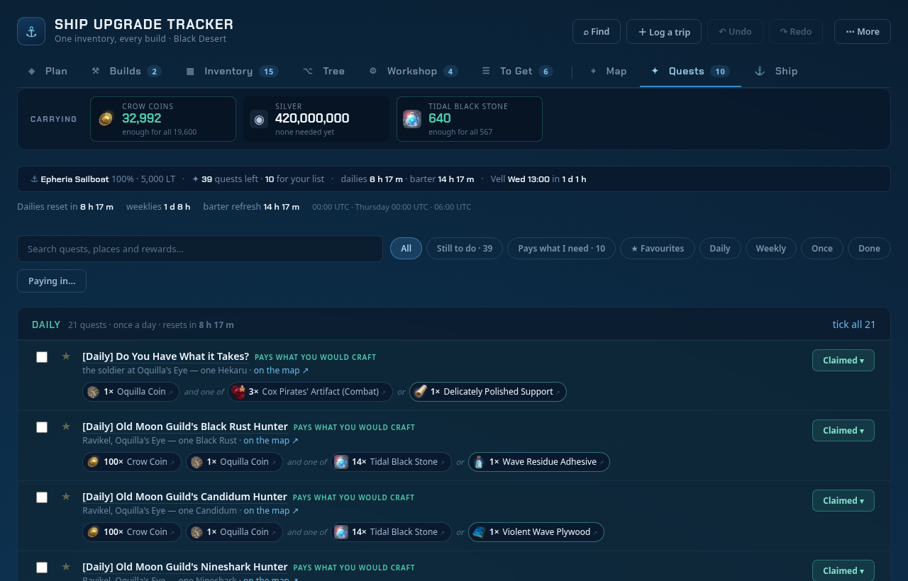

# Changelog

What arrived between one version of this app and the next, written for
someone who has been away. The same notes are in the app itself, under
**Menu → What's new** — this file is generated from them by
`node tools/build-changelog.mjs`, so the two cannot drift apart.

## 1.1 — The plan, and the sea you can actually reach

*2026-09-11*

Two players asked for this one, and both asks turned out to be the same complaint from different ends: the app knew a great deal and left the deciding to you. **To Get** now says how each thing *should* be got rather than only how it can be — one route through everything left, in the order it is done — and every barter plan is cut to the islands your own **total barters** have opened. Around those: the barter forecast counts how often the offer is really on the list, a crew reads off your own screenshots, the numbers about you are typed once and read everywhere, and the boards keep up with your save.

### Asked for by you

Both of the big things here came from players writing in, and both were better questions than the ones being asked inside. Thank you.

- **Kristofer** — *“it would be really convenient if, after you input what you currently have, it could suggest the most efficient way to obtain the remaining resources … it tells you how each **can** be obtained, but a logic to suggest how each remaining resource **should** be obtained would be fantastic.”* That is the whole of **the way to get it**, and the word *should* is what sent it after the places the sources compete rather than after a longer list.
- **Zelpha** — *“I wanna use the barter planning page but I’m only at 480 total barters, it would be nice if I could put that in somewhere and it’d limit the routes based on what I have available.”* That is **the barter count deciding which islands exist** — and it was worth more than a filter: fifteen of the forty recorded boards’ chains climb through an island 480 barters cannot reach, so that page had been quietly wrong for everyone below the thresholds.

The box is under **Menu → Feedback**: something wrong, an idea, or something else, with the section and the build attached. It reaches whoever runs the site.

### To Get — one route through what is left, in the order you do it

To Get answered “where does this come from?” for every line and left “so what do I do?” to you. The trouble is that the sources compete: a Candidum daily pays fourteen Tidal Black Stones *or* one Violent Wave Plywood and never both, the Crow Coins spent on plywood are not there for the tendons, and two materials off the ship-material list wait on the same three draws a day. Read one line at a time, every material’s best answer is “buy it”. Read together, the purse runs out and the answer changes. So the first view of To Get reads the whole list at once and gives every thing **one** way, with its reason on the line.

- It reads as **numbered steps in the order they are done** — run these quests, take these as quest rewards, buy at the Crow Coin Shop, barter for these at sea, hunt these, and on down to what has no rate at all — because the quests pay the coins that buy the shop’s half, and buying first empties the purse before the quests come round. Each step says where it happens, carries its own total, and folds away when you are done with it.
- Where the plan lands and every dial that moved it there are **one card**: *done in seven days*, the thing that sets that pace, the coins and silver it wants against what you can spare, and how many things across how many steps.
- It follows a **goal you state**, because what is scarce is yours to say and not the app’s to decide: **Soonest** spends the purse wherever it buys days, **Keep the coins** spends them only where nothing else sells the thing, **Keep the silver** leaves the Central Market alone. Beside them, how many days a week you are at sea, and coins you keep back that the plan will never spend.
- Three switches for **what you are actually willing to do**: the dailies and weeklies, bartering, and *hunt what drops*. The last takes every dropped material off the shopping list and never claims a rate for it, because none is published anywhere — on a two-part Carrack that is the difference between forty-three days and thirty.
- The quests are **errands**, not a list of names: how often, where it is done, the reward to take with its picture, the coins it pays — and when a pick-one was a real choice, what it was chosen over and why the other one is got another way. **Make it my pick** remembers it, so Claimed on the Quests screen records that reward in one press, and the Quests screen says the same thing beside a quest whose remembered pick differs.
- **What this plan will never do** is a line you can open, and it describes *this* plan rather than the idea of one: the rules in force right now, including the ones your own orders added.
- Every row names the ways the plan **could not put a number on** — what drops it, the worker node, the bulk exchange, the shop it did not use. Khan’s Tendon read as “nothing else sells it” beside a price, which is true of shops and false of Khan, and that is how somebody ends up buying a thing they could have killed for.
- The old reading is one chip away as **Every way**, and Copy and Copy as CSV follow whichever is showing. The Plan’s **Next** line names today’s first quest and what to take off it.

### Barter — only the islands your count has opened

The game opens the trade routes as your total barters climb: 150 opens Shipwrecked Haran’s Cargo Ship, 600 Lantinia’s Combat Raft, 3,000 the Wandering Merchant’s Ship. The app knew that table only well enough to print what the next threshold unlocks, and planned everything as though all ninety-one barterers were open to everyone. On the forty recorded boards, fifteen chains climb through an island a sailor at 480 barters cannot reach — and Tear of the Ocean is dealt at exactly one barterer, the one that opens at three thousand. Your count is part of every plan now.

- The join is the patch note’s own words: *opens* names a place and the chart says who stands there, so **twelve barterers are gated at the twelve counts the note states** and nothing is guessed. The seventy-nine it never names — the coastal [Level 6] and [Level 7] dealers among them — are open from the first day.
- What is behind a door is **said, not hidden**: the chains on the Barter tab sit locked and untickable under the ones that are yours, with a line above saying how many and what opens them; so do a material’s island chips and the islands the board question offers. The Map still draws the island and its card says what opens it, but no pin is lit there for something on your list.
- A forecast folds through the islands you can actually reach — a rung dealt in two places is priced at the open one — so where none is open the answer is the door itself: *locked, 2,520 more barters open the Wandering Merchant’s Ship*.
- **The whole table** is one press away, from the bar and from that line: every threshold, the island it opens and its barterer, ticked where it is already yours.
- **Nought barters is a real answer**, not a missing one. A sailor who has never bartered has the three routes the game starts them with and no more, and the app plans on that — so the bar asks for the number until it is given.

### Barter — how often the offer is really there

Every barter figure in the app assumed that what you want is on the list every time you draw it. It is not, and it is not a rounding error: of the four whole ship-material boards recorded, a Saltwater Crocodile’s Scale exchange was on *one*. A hundred of them read as five days where the boards say about eleven, and a plan wanting four materials off one list quietly assumed all four turned up, every day. The forecast now reads both records that ride with the barter table — those four complete boards, and the forty trade-list layouts seen across four hundred and twenty refreshes — and paces every rung by how often it was actually there.

- The old figure survives as the floor, with the sample named beside it: *about 11 days, 5 if the offer is always up · on 1 of the 4 boards recorded*.
- What is measured is **presence**, not how many islands showed it, so the change can only ever lengthen a forecast and never shorten one. A thing on every board recorded reads exactly as it did.
- Anything **no board has recorded** keeps the old best-case number and says so on the row, rather than passing it off as measured.
- Your own material-board diary is deliberately left out of the arithmetic: it records where a thing was and never where it was not, and a sample with no absences in it cannot measure absence.

### The sailor — the numbers about you, typed once

The barter count, your level, the Parley, the vouchers and the Value Pack were entered on To Get — the one screen that is not about the sea — with a second copy of two of them on the Barter tab and Sailing Mastery off on the Ship tab, all of them read everywhere. They are **the sailor** now: one group beside the pouch, in the strip that follows you from tab to tab, typed once and read by every plan.

- **How many sailors are out**, in the masthead, and beside it the crew — the accounts that have ever signed in. The first counts the browsers with the tracker open this minute. It needs no sign-in and keeps no address: a random token the browser makes for itself and two timestamps, which is why it says browsers rather than people.

### Ship — a crew read off your own screenshots, in any language the game is played in

Open Manage Sailors in game, screenshot it — or crop the Selected Sailor panel, either reads, and a mixture of both is fine — and drop the lot in. Names, levels, condition and every growth come back in a table to check before a single thing is written, and a sailor already on the roster is brought up to date rather than hired twice.

- **It reads every language the game runs in.** Say which one yours is and the reader speaks it: 식성 and 생활 물자 and Требуется кают are labels like any other, and a Cyrillic or Hangul or Han name comes back as the name. The Latin services read on the model already aboard; Русский, 日本語, 한국어, 中文, 繁體中文 and ภาษาไทย each fetch a megabyte or two more, once, the first time you pick them.
- Under the words is something none of the fifteen change — the weight carries LT, the condition is a pair over a slash, and the eight growths sit in the same order whatever they are called. So a label the scan could not make out costs nothing: the figure is still the fifth down the column, and a screenshot in a language nobody here can check still reads.
- It matters because the growths are the one thing the app could never estimate its way round. A levelled sailor rolls inside a hidden band, so a crew was worth its **average** roll and the ship’s speed came out under the game’s — 196.4% against 198.1% on a full Carrack, all of it in the crew. Read in, the rolls are the game’s and so is the number.
- The **ten per cent off Parley** is no longer a tick. It is Cleia’s skill and nothing else, so it is read off who is sitting at the First Mate seat: aboard, the Bartering line says so and names her; hired but ashore, it says what seating her would be worth.

### Ship — what a boat is for

Every hull now says what it is for, which the game’s own numbers never do: the Advance for bartering (the biggest hold, and a run pays by what it carries), the Volante for speed, the Valor and the Panokseon for sea monsters, the Balance for not choosing. It is on the ship card and in the picker — where searching “barter” finds the barter hulls — and the crystal picker marks the crystals that suit each.

- **Auto assign asks what the boat is for.** It used to add up the growths a seat doubles and take the biggest sum, which is a question nobody asked: the Sail doubles Endurance and Wits together, so a sailor with 1.1 speed and 4.8 acceleration beat one with 3.9 and 1.5, and the ship lost five per cent of its speed while the arithmetic said it had gained. It lays out every goal now and seats the crew for the one you pick.
- The **sailor list sorts by any growth** — Endurance, Wits, Awareness, Strength and the four cannon ones — as well as by type, condition and level, and the growth it was ordered by is shown on every card. Finding the fastest of eighteen sailors meant opening them one at a time before.

### Map — the chart, stood up

The chart has always drawn the sea from directly overhead, which is the right way to read a route and the wrong way to read a coast. The game’s own 3D map is not a picture anyone can copy — the client builds it on the graphics card every frame — but the terrain it is built *from* is in your own installed client, one mesh per 12,800-unit sector, on exactly the grid the flat chart’s squares are cut on. So the chart can be stood up: **⛰** on the zoom bar leans it over and puts the real ground under the sea.

- It is the **same chart**, not a second one. The same centre, the same zoom, the same barterers, wharves, habitats, traces and plotted loop — every one of them placed by the camera now instead of by the flat scaling, so they sit on the ground rather than beside it, and the switch either way lands on the water you were already looking at.
- **The world curves away** towards a hazed horizon, the way the game’s own map does and the way a planet does — it is what makes it read as a world rather than a diagram, and the pins, the route and the traces all bend with it.
- The ground **wears the chart’s own squares**: the islands are the colours you know, with the relief of the actual terrain under them. **Neon** draws contour lines over dark water instead, the way the game’s own world map does, and the interval widens as you step back so the lines stay lines.
- **Shift-drag leans and turns it**, an ordinary drag takes hold of the water and carries it, and **Level** puts you straight back overhead facing north. Where you left it is where it opens next time.
- The terrain is cut into the same kind of pyramid as the tiles — the far view draws a few hundred tiles instead of thirty thousand, and the closest zoom draws **the mesh the game itself draws from**, vertex for vertex. Tiles travel packed, a few kilobytes each, with the chart’s own thread of light along the top edge while they are coming — and **Keep this area offline** keeps the ground with the squares, so a crossing with no signal still has islands in it.

### Community — boards that keep up, and say how they count

What the boards show about you is worked out from the copy the server holds, and that copy is redrawn within seconds of a save reaching it — so a ship fitted, a sailor hired or a run logged is on the boards by the time you walk to them. Before, a change waited on the boards’ own window, and a card once opened never changed at all.

- Signing in puts you **on the boards by name** rather than leaving it to whoever went looking for the switch. The tab says so the first time you open it, **Leave the boards** is one press from there, and leaving is remembered — signing in again does not put you back. You can still be shown as an unnamed sailor, and what would be shared is still listed before you agree.
- Every board says **how it is counted**: a “?” opens the rule in full, and Best ship shows the sum behind the number — *hull 4,000 + parts 194 + crystal 20* — for the top of the board and for your own row.
- Your **fleet and your inventory are one fleet**. Keeping a setup puts its hull in the Inventory if none was recorded there, and a hull in the Inventory is a ship in your fleet, listed, sailable and counted on the boards, whether or not a setup was ever named for it.

### The yard — buying with coins, and a count that keeps itself

The app knew what a thing costs at Oquilla’s Eye and knew how many coins you held, and still made you do both halves of the sum by hand.

- Every Crow Coin line on **To Get**, and every coin-priced thing in the **Inventory** panel, carries a **Buy**: it asks how many, says what that costs and what is left of the purse, records the goods in and the coins out as one change, and opens on what the purse can actually cover. A sum that does not work is said rather than quietly clamped.
- **Total Barters follows the runs you sail.** The count that opens the next trade route was typed once and then left to rot while the app watched the very trades it counts go by. Recording a run adds its trades to it in the same change as the goods and the silver, so one Undo takes back all of it, and a run that carries you past a threshold says which route it opened. It is still a field you can type over.

### Put right

Things that were wrong, and are not now.

- **A hold barters to seventy per cent over its limit, not a quarter.** The islands deal right up to the point the hull stops moving, so there is no band where you can sail but not trade. The old figure came from one session in which a 27,000 LT hold seemed to refuse past about 34,000 — which is what a quarter over looks like, and is why it was believed. Chains that were cut short climb further for it, and material runs that were split into several departures go out in one.
- A **named first mate** has no growths of their own. The app credited each of the three half a point of speed, acceleration, turn and brake, which the game’s own panel shows none of, and fed them 100 rations a day where they eat 150.
- **Best ship** was <code>hull tier × 100 + enhancement levels</code>, which rated a +10 green Toro cannon exactly as highly as a +10 yellow Falasi one — three quite different Carracks all landed on 440 and shared first place. A slot is worth its part’s set first and its enhancement second.
- Ticking a stop **Done** on the Map’s run sheet no longer throws the list back to the top — on a nineteen-stop run that was a scroll back down every single time.
- The **hold bar** no longer prints its weight over its own second line, and the parley controls no longer run 613 pixels wide inside a 390-pixel screen.
- On a run’s checklist the **fourth** of an island’s four [Level 7]s can be tapped: the chips ran wider than the column and the last one sat under the hold beside it, taking every click aimed at it.
- Writing a route into <code>gameVariable.xml</code> keeps the untouched original aside as <code>.orig</code> and never writes it again. Before, the second write copied the first write’s output over the only backup.
- Two setups kept in the same moment are two setups; they shared an id before, and the second quietly replaced the first.
- A stored digest from an older build is **worked out again** rather than left standing, so a scoring change does not leave half a board wearing its old number.

## 1.0 — The yard and the sea

*2026-09-07*

The yard was here already: one inventory, the builds that draw on it, the Workshop and the shopping list. This release adds the sea you cross to pay for it — a **Map** with every barterer on it and the loop through them timed at your own hull’s speed, a **Barter** tab that plans a run on today’s board and sails it on the chart, the **Quests** the ocean hands out free, the **Ship** you sail it in, and a **Community** harbour — and the yard picks up what the sea brings back.

### Map — a chart of the sea, with your shopping list on it

A new tab. The **Map** is the To Get list drawn on the game’s own chart. Every pin is one of the 91 barterers, holding something you are short of; open one and it says what it hands over, how many exchanges are left and what the parley costs at your own Barter level.

- All 91 barterers, Levels 1 to 7, on the game’s own tiles, placed from client positions to within a pixel; the chart zooms from the whole sea to an island’s rooftops.
- One strip of switches — *On the chart* — says what is drawn: barterers, monster habitats, the 58 wharf managers, guild wharves, island names, your own traced routes.
- Monster habitats stand at the centre of each species’ spawns, kept to open water, each with its picture from the codex, and a ground switched on is drawn as its water.
- Two community maps are fitted to the chart on their island names: Awabi’s *Road to Cox*, and Vell’s waters from gpw’s ocean map.
- A ruler measures any two points, with the game’s own coordinates under the pointer, and a minimap you can drag out of the way.
- The sea’s clocks sit over the chart: the time to the daily, weekly and barter resets, and when Vell is next up on your servers.
- **Keep this area offline**: the tiles of the view you are on, a level either side, kept in a store the cache never sweeps.

### Map — a loop that says how long it takes

Plot the loop through everything you are short of and every leg comes back with its length and its minutes — bent round the land, at the speed *that* hull actually makes with those parts and those sail seats.

- What 100% is in metres the game never says, so a time is a range: a fifth either way around the chart’s 11 m/s estimate, a tenth once you have timed a leg and told it.
- The **rations** aboard drain over the route at an estimated rate; the Route tab says the stop they run low after and puts a rations call in at the nearest wharf manager. An overweight leg sails slower, and its minutes say so.
- Parley is budgeted at one trade a stop or at every attempt the offer allows; the stops past what your bar covers are marked, and a button trims to them.
- A leg the router could not bend round the land is drawn dashed and red and named in the panel, never a straight line through an island passed off as a course.
- Routes are kept by name, a replaced one is kept as the previous, and a route travels in a link or a small JSON file.
- **Put it on the game’s map** writes the stops into your own world map as favourites, or as one of its three navigation loops, the untouched file kept beside it — and the game’s map comes the other way, its bookmarks and loops landing on the chart.

### Map — draw a route the list cannot express

Click the sea for a numbered stop, drag to sketch a line, or type a word straight onto the water. Every mark is a place on the chart, so it all pans and zooms with the tiles.

- Eight inks, three pen widths, three sizes of writing, a shaded area, and an undo that walks back through stops, strokes and words in the order they were made.
- Legs bend round the land like a barter route’s, and a stop dropped on a headland steps off into the water beside it.
- A trace is kept by name and travels in a link or a file; twenty live on a shelf, and **Browse all** opens a library with a search over names, notes and the words written on them.
- A kept trace can be a **lane**: every route near it is drawn along it and timed as the game sails it.

### Map — a drawing in a link

A drawing is a thing to hand round. **Copy link** puts the whole trace — stops, notes, line and words — into one address; whoever opens it gets the chart flown to the drawing, on any browser, with nothing to install and nothing of their own touched.

- The link carries the drawing itself, not a pointer to it, so it works for someone who has never opened the app before.
- A trace taken in from a link is on the water like one drawn here: to draw on, keep by name on the shelf, lay over the chart with its eye, or send on again.
- The same drawing goes into the game’s own world map as favourites, and out as a small JSON file for a guild’s records.

### Barter — a run planned on today’s board, and sailed on the chart

A new tab. The trade-goods barters are not rolled island by island: every refresh the whole sea shows one of forty fixed layouts. So the **Barter** tab asks what one island is showing — tap it from that island’s possible offers — and the whole board follows: every chain the day allows, listed by how far it reaches and what it pays, and the ones ticked are one run.

- The hold is **what is aboard**, weighed against the ship as fitted and the ceiling the islands still deal under; goods ashore are listed by harbour with a Load button.
- The **sailing orders**: cash out today or build the stocks, which levels a wharf sells, land goods on or off, a cap on time under way — and three paces: *fast* keeps under the limit with no calls, *full* does every attempt and leaves the surplus at a wharf before the hull slows, *full, loaded* takes the hold to the barter ceiling.
- **Runs worth sailing**: a search over the board’s chains proposes the most silver, the most an hour and the most a Parley unit; one tap lays a run out.
- Or a run for **a material**: one route through every island ticked, the harbour a give is kept at called at before the first island that needs it, and what to have before casting off named — bought ashore, brought from another storage, or got first.
- The **quests come along**: handed in where the run passes anyway, a stop put in for a taker a short way off, a hunt given a stop at its grounds; the barter quests are counted off the run’s trades.
- **Sail this run** draws the route on the Map and the chart’s panel becomes the run sheet: the trades, the hold and the Parley after each stop, the wharf calls, Done stepping on to the next stop. Saying what an island paid re-counts the rest, and **Record the trip** puts the whole of it in the Inventory as one undoable change.
- What islands paid goes into your own record, and the runs worth sailing are worked out off the page, in a worker with a budget of a second and a half.

### Quests — what the sea hands out free

A new tab. Every quest that pays in a ship material, grouped by how often it comes round, with the ones paying in something your plan still wants marked. Claiming puts the reward in stock and ticks the quest until its own reset.

- Tick several and **Finish** records them together as one undoable change.
- A pick-one reward is remembered, so the next claim takes the same one in a single press.
- Keep a set you run every day as a named group, star the ones that matter, and filter by what is still to do, what your plan wants, or one reward in particular.

### Ship — the other half of a ship

A new tab. The **Ship** screen carries every hull in the game’s own numbers and fits it out as five slots — the four parts and the sea crystal — each taking the best you already hold, or one you choose.

- All 287 sea crystals from Eltro to Rusalka, plus Ebenruth’s Nol and the Oceanteared Nol, chosen by grade with the effect beside the name.
- A crew planned against the hull’s seats and cabin space: contracts, condition, food, first mates, and the certificates on the shopping list; a sailor’s real numbers can be typed in and are judged against the band their level can hold, and a log of the levels reached tells a fast grower from a slow one.
- Your Sailing Mastery counts toward speed, acceleration, turn and brake; the hold reads as a sum of lines, and says how far past its limit the hull will still sail.
- Keep a whole fit-out as a named **setup** and switch between them here or from the Map, where the route is timed.

### Ship — your build in a link

The hull, its four parts, the crystal, the roster and who sits where, in one **Copy link**. Opened at the other end it says whose ship it is and what is on it, marks each part you already hold, and offers **Make it my ship** — or queues the missing parts as builds, so the Plan prices the way to it.

- Looking costs nothing; taking it replaces that hull’s parts and seats and your roster, and one Undo takes it back.
- A sailor’s typed numbers travel with the roster, so a crew someone has measured is the crew you get.
- On the Community tab a place on the Best ship board opens the same way: that sailor’s boat stood up on the Ship tab, to look at and not to keep.

### Community — the harbour

A new tab, where there is sign-in: sixteen boards — mastery, the best ship, the best sailor, the most silver from runs, the most monsters hunted, the luckiest at the anvil and the rest — and the fleet in numbers: the hulls most sailed, the parts most fitted, the islands most plotted, the quests most done.

- Only the sailors who take part are on it, by name or as an unnamed sailor, and what would be shared is shown before anyone agrees.
- A place on a board opens what it is about: the Ship tab stood up on that sailor’s boat, to look at and not to keep, one press back to yours.
- The profile keeps a **tally** of the career — quests claimed, runs sailed, things made, attempts at the anvil; Undo takes a count back with the thing it counted.
- **Menu → Feedback**: something wrong, an idea, or something else, with the section and the build attached; it reaches whoever runs the site.

### The yard — what the sea brings back to it

The Plan, the Inventory, the Workshop and To Get are as they were, with what the new tabs feed them: a **Today** strip on the Plan with the quests still open that pay in something on your list, the time to the daily, weekly and barter resets, when Vell is next up on your servers, and the pace each build has been moving at.

- Anything the Central Market sells is priced from the Market itself, per region, and the app says how old the number is; the last prices a browser saw stay on hand offline.
- Vell’s EU and NA timetables, correctable where they are shown, with a reminder a quarter of an hour before — by push, where the deployment has a key pair.
- The trophies the sea monsters drop are in the book: a Usable Pirate Ship’s Remains chops into a Deep Tide-Dyed Standardized Timber Square, a Khan’s Tendon dries into ten Moon Vein Flax Fabric, ten Broken Cannons or two hundred seals make a Cox Pirates’ Artifact. The plan still buys those unless you switch one to *Craft it*, since the shop is the road and the trophy a side door.
- The small craft too: a Cog two ways, three rowboats and a raft.
- Every kind of item has a **home**: an item’s count is what is in your bags plus every storage you have noted it at, a trade good is never in the bags, and new goods can land at Iliya instead.
- **Redo** beside Undo; Import asks whether to replace or merge, keeping the higher count of anything counted twice; exports are dated; the shopping list copies as **CSV** and prints legibly on white.
- A field guide behind one quiet dot: the game’s own windows, so a number here can be traced to the screen it came from.

### Around the app

Every section sits in a **dock** across the top of a wide screen, the icon over the name; on a phone four sit at the thumb and the last slot opens the menu. That **Menu** — `M` on the keyboard — is the one menu the app has: every section, Find, the trip log, Undo and Redo, your save, the help and the settings.

- **Find** on Ctrl+K (or `/`): an item opens in the Inventory’s panel, a tab opens; the digits 1–9 switch tabs, `0` the tenth.
- **Log a trip** records everything you brought back in one box, as one undoable change.
- **Profiles**: separate saves on one browser, for an alt or a what-if; the Map’s routes and traces and the Barter tab’s board and run belong to the profile, so they export, sync and switch with it.
- Every choice the app asks for goes through one picker: pictures, a fact beside each name, a search that ranks a name starting with your letters first.
- The address bar names the tab and the open item, so a place survives a reload, travels in a link, and Back retraces your steps.
- Quantities read the way your browser writes them, and item look-ups open BDOCodex in any of twelve languages.
- A **light theme**, under Menu → Theme, that follows the system when asked. One phone query, so a phone on its side gets the phone’s shell — and on the Map, the chart — instead of the desktop’s header eating the screen.
- Hit areas of forty pixels under a finger; the faint inks lifted to read against the ground; the bottom sheets clear a phone’s gesture bar; a name on every search box, a state on every filter, a name on every dialog; Escape shuts the menus.
- A thing done is answered with a small burst of light where the tap landed — a soft glow instead when motion is asked to keep still.

### What the save keeps

A build’s route choice, the sort and the filters on the Plan and the Inventory, each tab’s place on the page — all kept across a reload.

- A **named route** is never dropped to make room for “Previous route”, which has a slot of its own; a ninth asks which to replace.
- The undo history remembers only the fields a change touched and is trimmed to a budget in bytes; a write the browser refuses is said out loud, with **Export now** beside it, and a save that will not parse is copied aside before anything is written over it.
- An import says which names this version does not know. A link travels slim, says how long it is, and warns when a chat would cut it.
- The game file’s **Restore** puts the old block back byte for byte, whatever Version the client writes, BOM kept; the file from before the first write stays beside it as <code>gameVariable.xml.orig</code>.

### Underneath

None of this is visible, and all of it is why the rest works.

- Every screen is its own module; the planner stays pure, and each screen is a projection of it.
- Offline, the app runs from a snapshot of one deploy — never a mixture of two; a newer deploy installs behind the page and waits for the next visit.
- The barter catalogue is served as data rather than as script, and everything heavy travels compressed; the tiles are told to be kept for a year by every cache on the way.
- The tour’s library is vendored, so the page needs no CDN and the CSP can stay shut.
- <code>/healthz</code> says whether the database answers; push subscriptions go only to the real push services; an Origin check on every write; a schema version and a runner for the next change; <code>npm run backup</code> and <code>restore</code>.
- The Market relay spends at most twenty-five seconds on a call and answers the rest from the copy it holds.
- A test suite of 561, run on every push, covering the cost model, the sync API and the client in a real browser.

### The tour, and the film

The guided tour walks the new sections as well as the yard, pointing at each thing on your own screen, and the walkthrough film goes on from the yard to the sea and the harbour — a run on today’s board, sailed on the chart. Neither is a mock-up: they drive the real app, so a screen that changes makes them wrong until they are shot again.
