# ⚓ BDO Ship Upgrade Tracker

Plan Black Desert Online ship upgrades against **one shared inventory**.
Queue as many ships and parts as you like; the tracker works out what
each one still needs, what you can make right now, and what you have to
go and get — without ever promising the same 100 planks to two builds.

Runs entirely in your browser. No account, no server, nothing leaves your
machine — [unless you turn on sync](#syncing-across-devices), which is
opt-in, self-hosted and off by default.

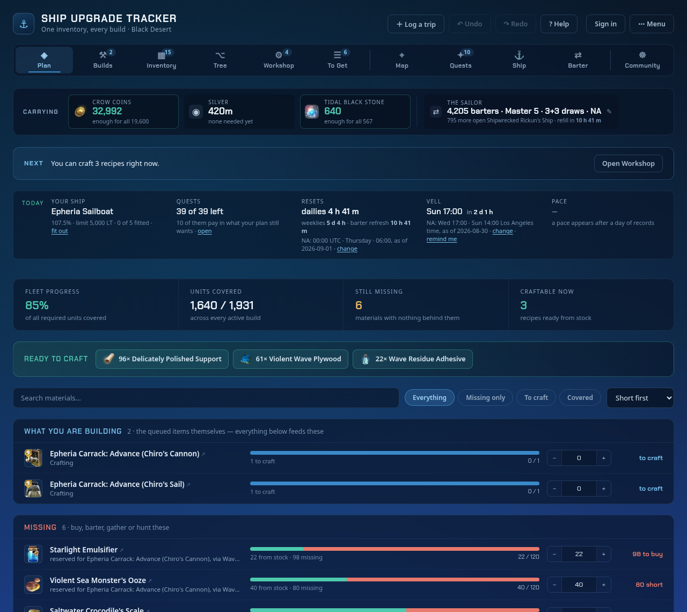

**In a hurry?** [Watch the walkthrough](docs/media/walkthrough.mp4) — the
yard first: queue a build, choose how to get there, record what you
gathered, make something, see what it will really cost, take the list
shopping. Then the sea: the day's free quests, the ship you sail it in,
and the chart, where that list becomes a loop with minutes on it and a
blank stretch of water can be drawn on. It is the real app, driven and
captioned — nothing is staged — and there is a
[narrower cut for a phone](docs/media/walkthrough-phone.mp4). Both play
inside the app too, under **Help**.

---

## The loop

### 1. Queue what you want to build

Any ship, any part, or a stack of materials. Order matters: when stock is
short, the build nearest the top of the queue gets it first.

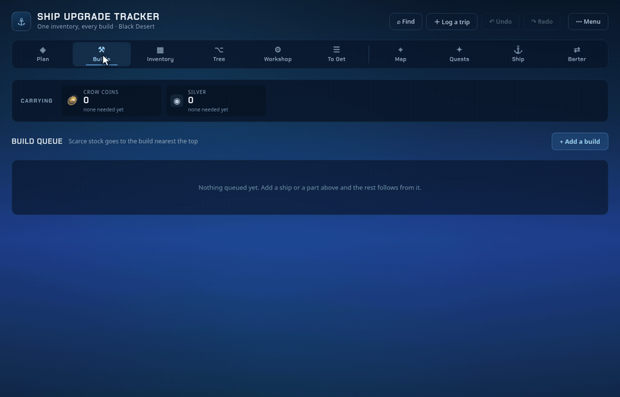

**Some ships can be reached more than one way.** A Caravel takes either a
plain Epheria Sailboat or an Improved one; a Galleass either Frigate. The
step itself is identical — bdocodex lists both with the same materials —
but the Improved route is a whole upgrade of its own first, and wants
four more Epheria: Old parts. It also adds a solo cannon volley, and its
quests can be done alone, which is a real reason to take it.

So queueing one asks which, shows what each costs, and the build then
says the route it is taking. Neither is marked correct.

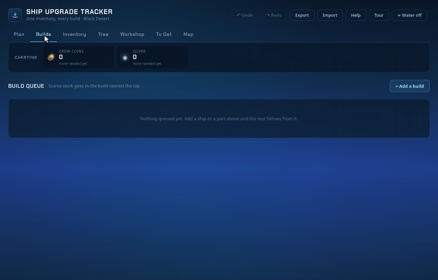

### 2. Record what you gathered

This is the thing you do day to day. Type into the box on any row — `4k`,
`250k` and `12,000` all work — and every build re-plans around it: bars
fill, the shortfall drops, and recipes move into *craftable now*.

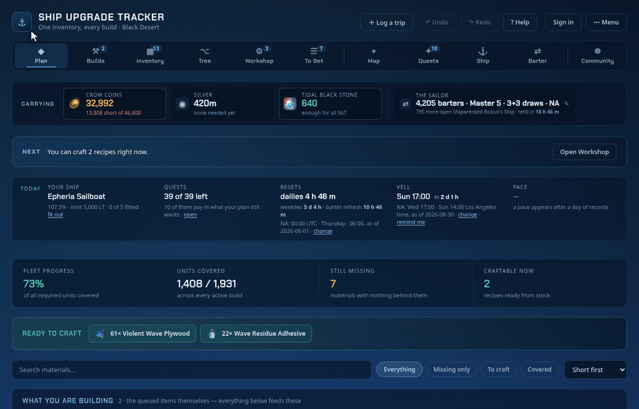

### 3. Craft and enhance

The Workshop lists everything you have the materials for. Name a batch
size or take the lot; crafting moves real stock — ingredients out,
product in — and it can be undone.

Enhancement is separate, because an attempt can fail. Blue and green ship
parts keep their level when one does; the yellow Falasi and Cheongun tier
drops one, which is why Cron Stones are part of what an attempt there
costs. Record **Succeeded** or **Failed** and the materials come off your
stock either way.

Below the yellow tier an attempt takes a **failstack** too. The game
publishes no per-stack figure for ship parts, so the Workshop assumes
the standard line — a tenth of the base rate a stack, capped at 90% —
and says so; blank means the quoted rate.

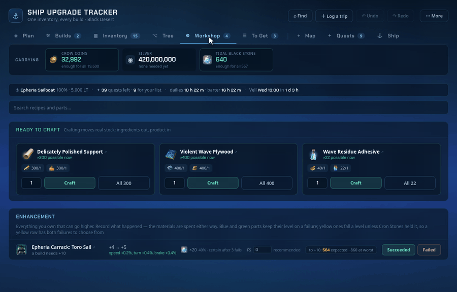

### 4. Take the list shopping

Everything still missing, grouped by how you actually obtain it — Crow
Coin Shop, Falasi's silver, barter, worker nodes, hunting — with running
totals measured against what's in your purse.

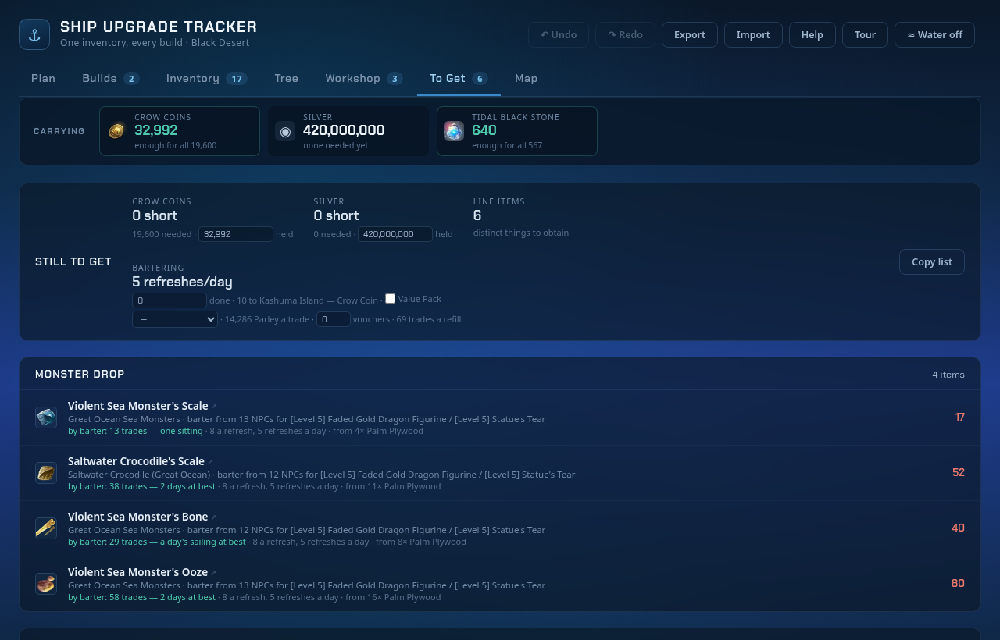

---

## What else it does

### Hover anything to see what goes into it

Rows, tiles, craft cards, even the build picker. Your own counts show
beside each ingredient in teal or red. An enhancement level shows the
part and the stones one attempt costs instead.

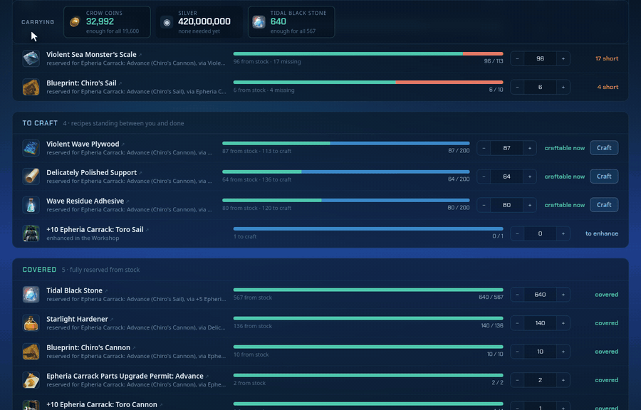

### Record a level you already reached

A part and its ten enhancement levels are one tile, not eleven. Open it,
pick the level you actually have, and it is recorded — **no stones are
spent**, because the Workshop is for attempts you are really making.

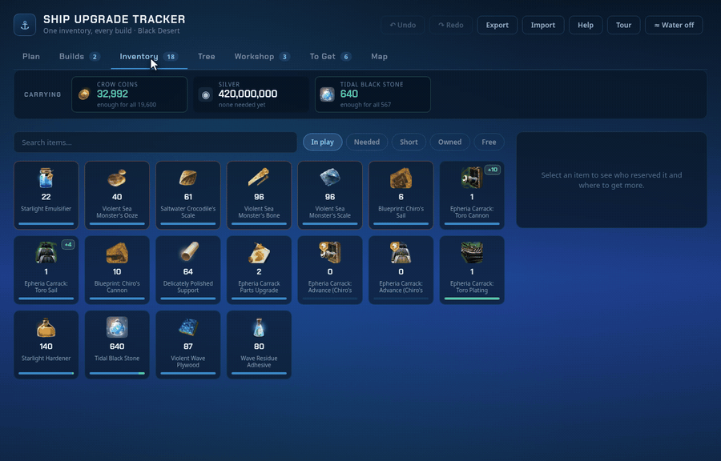

### See why a build needs a thing

The Plan is one row per material, which answers *what am I short of*. The
Tree is the same thing unflattened, and answers the other question: a
Carrack sits over the Caravel it is made from, over the Sailboat before
that, with the materials of each hanging off the step that wants them.

Enhancement chains start folded, because a `+10` pulling in `+9` pulling
in `+8` is ten rows that all say the same thing.

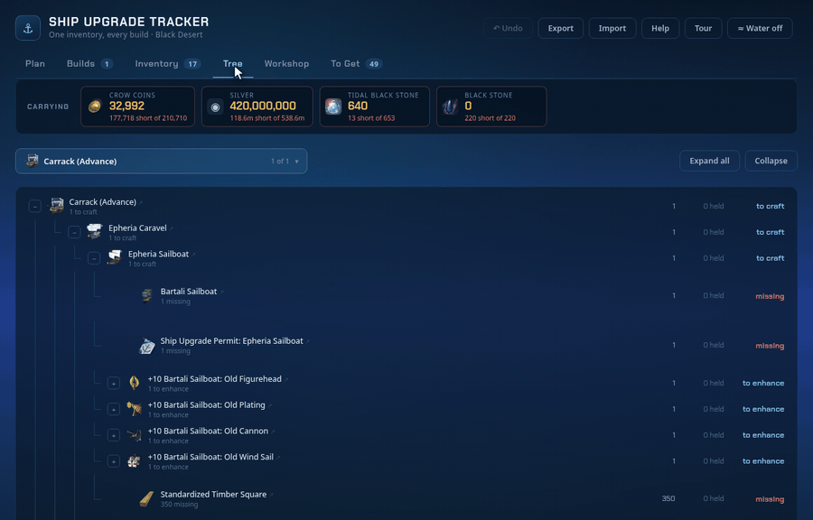

### Know what it will actually cost

Every part has a shop price, and none of them tell you what the thing
really costs. Open any item and it prices each route end to end: the
Crow Coin Shop's number beside what making one costs once *its*
ingredients are priced too, all the way down the recipe.

Crow Coins and silver are kept apart, because the game will not trade
one for the other, and anything with no price — bartered for, dropped —
is named rather than quietly counted as free. So a Carrack part reads as
*57,029 coins + 1b silver + 100× Violent Sea Monster's Scale*, not as a
number that hides the barter grind behind it.

Where an item can be both made and bought, both are shown side by side
with the one your plan is using marked, and neither is called the right
answer unless it beats the other outright. Each build in the queue
carries the same figure for what is left to finish it, which falls as
you record what you gather.

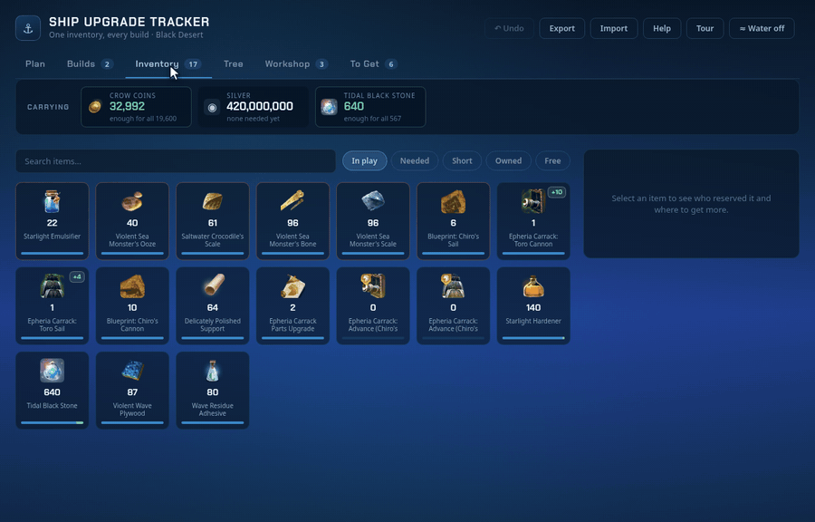

### Look anything up

Every item name in the app links to its page on
[BDOCodex](https://bdocodex.com/), in a new tab — in the Plan, the Tree,
the Workshop, the shopping list, and in the ingredient lists inside the
detail panel. Enhancement levels link to the base item, which is where
the level table lives.

### See who reserved what

Every material shows how much is spoken for by a build and how much is
still free, down to which build and through which recipe. When something
can be both made and bought, you choose, and the plan follows.

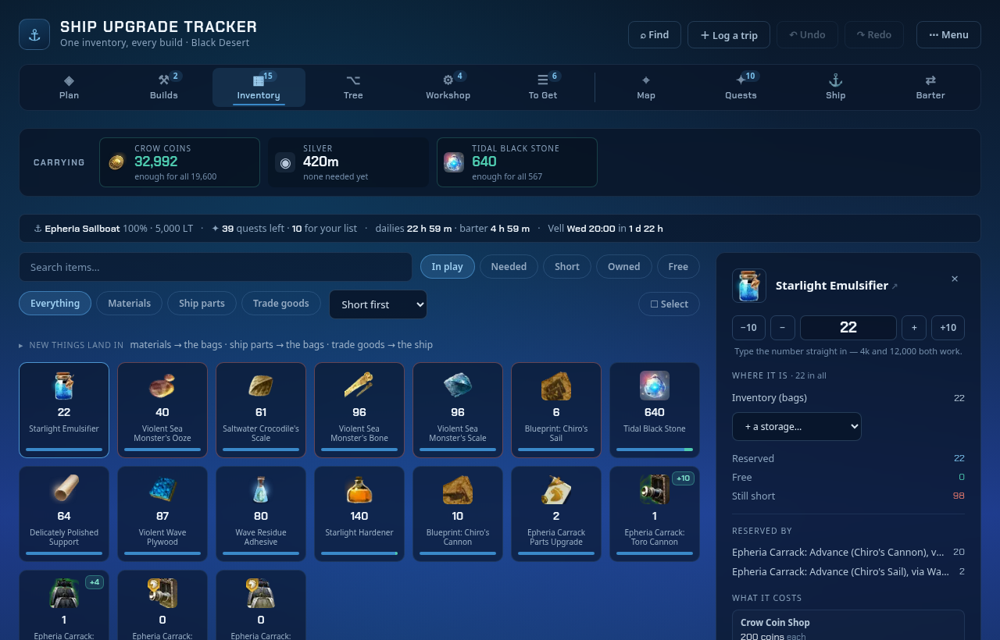

### And the rest

- **Undo** on every change, and a one-line **Next** banner that tells you
  the single most useful thing to do right now.
- **Sort** the Plan and the Inventory by shortfall, need, what you own or
  name; **search** on every list, the Workshop and the shopping list too.
- **The address bar knows where you are** — the tab, and the item you
  have open — so a place survives a reload and travels in a link, and
  Back retraces your steps.
- **Start fresh** clears everything behind a confirmation, and **Import**
  asks whether to replace what you have or merge the file in, keeping the
  higher count of anything counted twice. Exports are dated.
- Quantities read the way your browser writes them: `12.000` is twelve
  thousand on a German machine and twelve on an English one.
- **Your purse** — Crow Coins, silver, Sangpyeong Coins and enhancement
  stones ride along above every tab, since you spend them from every tab.
- **Export / Import** a JSON backup to move between machines — or
  **a link**: the whole plan rides in the address, gzipped, to look at
  on any browser without saving, or to merge or take in.
- **What's new**, a release's worth of notes with a picture each, shown
  once to a browser that has seen an older version and reachable any
  time from *More*. The same notes are [`CHANGELOG.md`](CHANGELOG.md).
  Neither it nor the tour interrupts someone who arrived on a shared
  link — they came to see that one thing.
- **A guided tour** that walks all nine views on example data, pointing
  at each thing on your own screen, then hands your own data back
  untouched — and reads a phone, where it points at the bar at the thumb
  and the hamburger the header folds into. Alongside it a **Help** film
  of the whole thing end to end, for when you would rather just watch.
  Help also lists **what changed** and **when each dataset was last
  checked**.
- **Find** anything with `Ctrl+K` (or `/` on its own): an item opens in
  the Inventory's panel, a tab opens. The digits `1`–`9` switch tabs.
  Every choice the app asks for — a hull, a part and its level, a
  sailor type, the rewards to narrow the quests to, an item a trip
  brought back — goes through one picker: rows with a picture, a fact
  beside the name, a search box that ranks a name starting with your
  letters first, the keyboard, and ticks where several are wanted.
- **The masthead** keeps five buttons — Find, Log a trip, Undo, Redo,
  More — and folds Profiles, Export, Import, Help, Tour, the water and
  Start fresh into *More*. The tabs sit in two groups: the yard, where a
  build is planned and made, and the sea. Each tab keeps the search
  typed on it.
- **Log a trip**: everything you brought back, in one box, as one
  undoable change.
- **Where it is**: an item's count is what is in your bags plus every
  storage you have noted it at — Velia, the ship's hold, wherever — so a
  number typed at a place moves the total, and a total typed lower comes
  off the places.
- **Profiles**: separate saves on one browser for an alt or a what-if;
  sync mirrors the main one only.
- **Look-ups in your language**: Help lets you pick the BDOCodex locale
  every item link opens in (French, German, Korean and nine more).
- Works on a phone — a tap on a row or a chip shows the hover card, a
  second tap puts it away; the water shader is optional (`≈ Water` in
  the header). Offline it runs from a snapshot of the last deploy, never
  a mixture of two.

---

## The day itself

The yard is where a build is planned and made. The rest of the game
happens at sea, and the last three tabs are about that: the quests it
hands out, the ship you sail, and the chart you sail it on.

### What today can do about it

The plan says what is left; the **Today** strip on the Plan says what
today can do about it: the quests still open that pay in something on
your list, how long until the dailies, the weeklies and the barter
refill reset (00:00 UTC, Thursday 00:00 UTC and 06:00 UTC), when
**Vell** is next up on your servers — the EU and NA timetables as of
2026‑08‑30, correctable in place, with a reminder a quarter of an hour
before while the tab is open — and the **pace** each build has been
moving at, with the finish that pace implies. The pace is a diary kept
in this browser, not part of the save.

With a key pair configured (see below) the Vell reminder reaches a
phone with the tab closed; without one it fires while the tab is open.

### Quests: what the sea hands out free

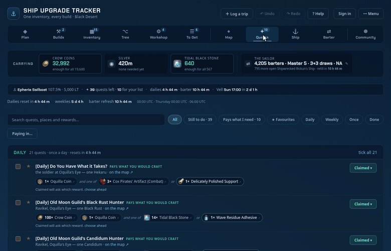

**Quests** are a checklist. Claiming a reward puts it in stock and
ticks the quest for the day or the week it counts for; the tick wears
off at the reset by itself. A pick-one reward is remembered, so the
next claim takes the same one in a single press (an *other reward…*
link is there for the day you change your mind). Tick several quests
and **Finish** them together as one undoable change — the ones whose
choice is not yet known ask, the rest go through — and keep a set you
run every day as a named **group** (one click ticks it) or **star** the
ones that matter. Filter to what is still to do, what is done, what
pays in something your plan still wants, your favourites, or one reward
in particular — the ones on your own list are offered first; every
quest's name opens its BDOCodex page. Ravinia's log shows how many of
its letters you have recorded.

### One ship, every tab

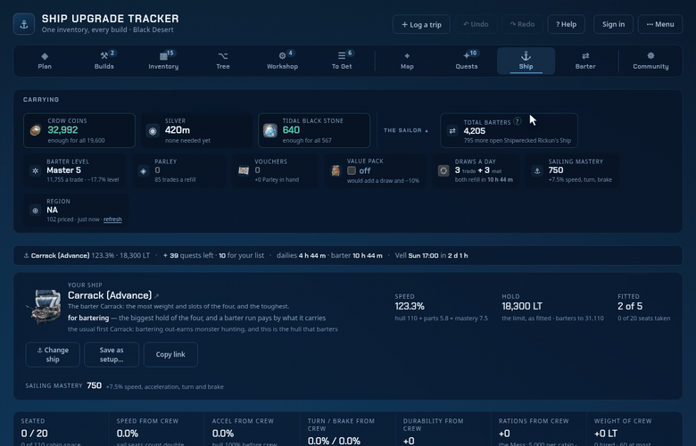

The **Ship** screen opens on the ship as a card — and keeps **setups**:
a hull with its parts, crystal and seating under a name, to switch
between here or from the Map's route timing (the crew roster itself is
shared). Your **Sailing Mastery** goes in beside it and counts toward
speed, acceleration, turn and brake the way the game's table has it.

The screen fits the hull out as five slot cards — the four parts and
the **sea crystal**, every one of the codex's 287 variants from Eltro to
Rusalka plus Ebenruth's Nol and the Oceanteared Nol, chosen by grade
with its effect beside the name and added to the hull's numbers: each
slot takes the best part you hold by itself, or one you choose — a part
you own but have not recorded, or a plan you are weighing, marked as
such, and recorded in your inventory with one press. The roster can be
ticked for a bulk recover, disembark or dismiss, and the hull, its
parts and its crew travel in a link of their own.

From that one setup follow the speed the Map times a route at, the hold
a run can carry once the crew's own weight is aboard, and the "Your
ship" tile on the Plan.

**Sailors' real numbers.** Growth is a hidden random range per sailor,
so the type's figures are averages. The Ship screen lets you type what
the sailor window shows for each stat, and everything downstream — the
hull's speed, the route's minutes — follows the typed number.

### The chart, and what it draws

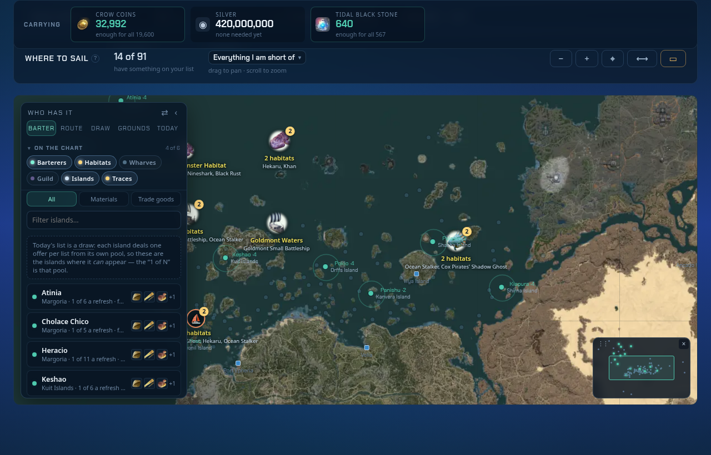

**What the chart draws** is one strip of switches — *On the chart* —
above the panel's tabs rather than inside any of them, since it is the
same question whichever tab is open: barterers, habitats, wharves,
guild wharves, island names, traced routes. It folds away when it is in
the road, and a phone starts with it folded. The five tabs are named
for what they do: **Barter** (who has what you are short of),
**Route** (plot the loop), **Draw**, **Grounds** (monsters and
community courses) and **Today**; the side panel sits on whichever side
you like.

The chart draws the game's own **habitat markers** — each species'
picture from the codex at the centre of its grounds, "Hekaru Habitat",
"Young Sea Monster Habitat" — which are also in the *Showing* picker.
Every spawn point is kept to open water — the codex draws a region's
spawns as a grid that runs straight over islands — and each marker
stands at the centre of a species' spawn cluster, on the water; markers
that would print on top of one another at a given zoom share one
picture with a count. The Lyngbakr Habitat of the 27 August 2026 patch
is twelve positions bookmarked on the game's own map, north of the
crocodiles' old ground (the Nineshark and Black Rust spawns the codex
still lists in that old ground are left out), and the crocodiles' new
ground is placed off the game map's icon north-north-west of Cheongsa
Island, roughly, until the codex carries it. Two community maps are on
the chart too, fitted to it on their island names: Awabi's *Road to
Cox* — the Cox Pirates' camps (six to eight seals), flags and cargo
ships, a group of their own on the Grounds tab — and Vell's waters from
gpw's ocean map. The chart can also draw all 58 **wharf managers**
(repair, rations, sailors) and guild wharves, named by harbour, and
**island names** faintly once it is close enough to read them.

### Plot the loop, and know how long it takes

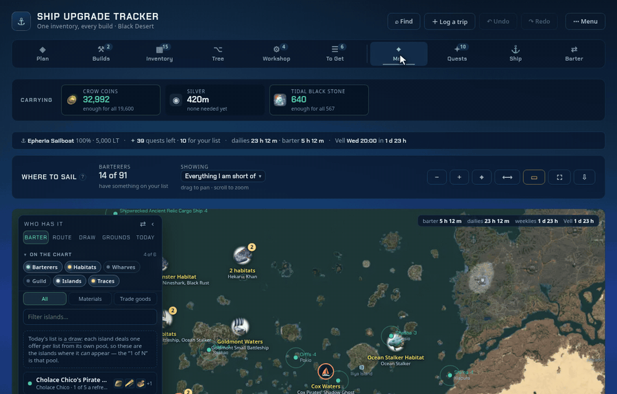

**Routes** say how long. Every leg on the Map's Route tab carries its
length and the minutes it takes at the speed that ship actually makes
— hull, parts and sail seats — over the line as it is bent round the
land. What 100% is in metres the game never says, so every time is a
range: a fifth either way around the chart's 11 m/s estimate, a tenth
either way once you have timed one leg and told it. Parley is costed at
one trade a stop or at every attempt the offer allows; the stops past
what your bar covers are marked and a button trims to them. The trade
goods in your stock are read against what each stop hands over. Routes
are kept by name, a replaced route is kept as the previous one, a route
travels in a link, and a ruler (`⟷`) measures any two points on the
sea, with the game's own coordinates under the pointer. The Route tab
names the nearest wharf to the last stop.

### Draw a route the list cannot express

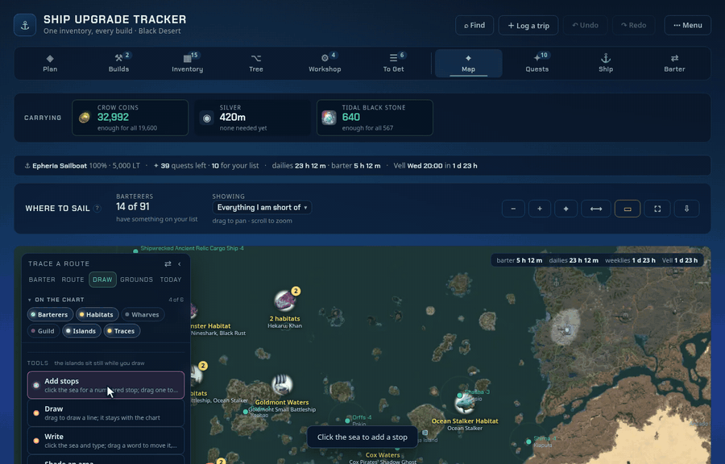

The **Draw** tab is for routes the barter list cannot express: pick
*Add stops* and click the sea, *Draw* and drag a line, or *Write* and
type a word straight onto the water — every point is a place on the
chart, so it all zooms and pans with the tiles. There are eight inks,
three pen widths and three sizes of writing, and while the tab is open
the chart's own markers stop answering, so a line can be drawn across a
barterer without opening his trades. Undo walks back through stops,
strokes and words in the order they were made, and a stop or a word
already down is dragged where it belongs — a word tapped rather than
carried opens to be retyped. Each stop takes a note; a trace is kept by
name, travels in a `#trace/` link or a JSON file, and its stops go into
the game's world map like a route's — with the written words as extra
favourites. Legs are **bent round the land** by the same router the
barter route uses — two stops with an island between them are not a
straight line — and a stop clicked onto a headland steps off it,
because a stop is a place a hull can float; *Straight legs* turns the
routing off.

Up to twenty traces live on a shelf below, each drawn small with what
it holds and when it was kept: open one to draw on it, rename it, copy
a link to it, or open its **eye** to lay it over the chart beside
whatever else you are drawing. The shelf keeps to the newest few and
whatever is on the water; **Browse all** opens the library, which has
the room for a search (names, notes and the words written on them), a
sort, and every trace as a card.

---

## Running it

```bash
git clone https://github.com/waliori/bdo-ship-upgrade-tracker.git
cd bdo-ship-upgrade-tracker
npm install
npm start
```

Then open <http://localhost:8000>. Set `PORT` to use another port.

`npm test` runs the suite: the sync API against a throwaway libSQL file,
and the browser half driven in a real Chrome.

`node tools/build-shell.mjs` rewrites the service worker's precache
list from the import graph; the test suite refuses a module left out.

`node tools/build-changelog.mjs` rewrites [`CHANGELOG.md`](CHANGELOG.md)
from the release notes in `js/about.js` — the same ones the app shows
under **More → What's new**; the suite fails if the file is stale.

`npm run capture` re-shoots every picture and clip in this README, and
both cuts of the film, by driving the real app in a headless Chrome —
so a screen that changes never leaves the documentation quietly lying
about it. See [`tools/capture/README.md`](tools/capture/README.md).

### Docker

```bash
docker compose up -d
```

or, without compose:

```bash
docker build -t bdo-ship-tracker .
docker run -p 8000:8000 bdo-ship-tracker
```

`docker compose` picks up a `.env` if there is one; plain `docker run`
needs `--env-file .env`. Neither is required to run the tracker itself
— see [Syncing across devices](#syncing-across-devices).

---

## What's covered

**Ships** — Epheria Sailboat, Improved Epheria Sailboat, Epheria Caravel,
Epheria Frigate, Improved Epheria Frigate, Epheria Galleass, Carrack
(Advance / Balance / Volante / Valor), Panokseon — and the small craft:
the Epheria Cog by either of its two designs (Falasi's permit and land
materials, or the Fallen Vell Pirates' four bartered ones), the three
rowboats and the Raft.

**What each hull is** — durability, rations, weight limit, inventory,
cabin space, sailor seats, cannons and reload, and the four movement
percentages, read off each hull's codex page. The Builds screen shows the
line under every ship; the **Ship** screen shows the lot.

**What each part does** — the equip effect of all 72 enhanceable parts at
every level from +0 to +10: speed, acceleration, turning, braking, DP,
damage reduction, weight, rations, durability, cannon damage and reload.
The Workshop says what the next level adds beside every attempt, the hover
card says what a part does at the level you hold, and the Ship screen
sums the best part you own in each slot onto the hull — the answer to
"is +8 worth it" in the game's own numbers.

**The crew** — the twenty sailor types with their race, cabin cost,
appetite, weight and per-level growth, and where each is hired; the seven
positions and what each doubles; condition and sickness and what mends
them; the experience split; the three first mates; where the sailor slots
come from. Plan a crew against a hull's seats and cabin space, see the
contracts priced, and put the certificates on the shopping list.

**Carrack parts** — all 16 of the craftable Chiro parts (Advance,
Balance, Volante and Valor × cannon, sail, figurehead and black plating),
including their processed materials, the blueprints from the Al-Nahad,
Racid, Lerao and Tinberra worker nodes, and the full enhancement chains.

**Panokseon parts** — Haemo's four green parts and the Byukgye's Enhanced
blue parts they become, with their blueprints from Dallae Pier Quarry and
the permit from Moodle Village Shipyard.

**The yellow tier** (August 2026) — the 16 Falasi Carrack parts and the
four Cheongun Panokseon parts, each consuming the `+10` blue part of its
own variant, with the three new coral materials, the Lyngbakr drops under
them, the five-billion-silver permits, and Sunset Tidal Black Stone at a
hundred Tidal Black Stones each. The blueprints are modelled as the
exchange they are — two Sunset Coral Essence each from Falasi, four from
Gangman — so a part shows the twenty essence behind its ten blueprints
rather than stopping at the blueprint.

Recipes were read off the workshop designs rather than the patch notes
alone, because the notes write one recipe for all four Carrack variants
and leave it open whether the Chiro part has to match. It does: an
Advance Falasi cannon takes an Advance Chiro cannon and an Advance permit.

**Free from quests.** Ravinia's Ship Upgrade Log — fifty of each Upgrade
material and twenty Tidal Black Stones over its seven days — and the Old
Moon Guild's dailies and weeklies, the soldier's dailies at Oquilla's Eye
and the supply runs, with their exact rewards. The shopping list puts the
ones that pay in what you are short of first, and one press records a
claimed reward in your stock.

**The Market.** What Falasi and the Crow Coin Shop sell is priced from
their lists; what only the Central Market sells — plywood, ingots, saps —
is priced from the Market itself, per region, relayed by the server from
the community market API and remembered so the plan stays priced offline.
The shopping list says how old the numbers are and lets you ask again.

**Mass Process** can be ticked when recording a craft of the yellow
materials, so the Black Stone Powder it takes leaves your stock too.

**What enhancement really costs.** Every enhanceable part carries its real
per-level success rates, and the Agris Essence pity caps that guarantee an
attempt after enough failures. So the plan budgets what the climb will
actually take rather than assuming every attempt lands — for a blue
Carrack part that is the difference between 500 stones and about 5,600 —
and the Workshop tells you the odds in front of you and the most it can
possibly cost.

The yellow tier changes the arithmetic, because a failure there takes a
level rather than just durability. The Agris meter belongs to the step
and is only spent when that step succeeds, so falling past one leaves it
where it was — but the level below has to be climbed again from a meter
the last success reset. Compounded over ten levels that runs to around
52 million Sunset Tidal Black Stones, which is why Cron Stones are
counted as part of what an attempt costs rather than as an optional
extra. Protected, the same climb is about 72 stones and 30,000 Cron.

A yellow row in the Workshop has three buttons, not two: **Failed — no
Crons** records the attempt that was made unprotected, spending the stone
and dropping the part a level. And because the yellow rates scale with
the failstack you bring, you can type yours in and every yellow forecast
follows it; blank means the stack the quoted rates assume. Each row also
keeps score — attempts won, attempts lost, stones spent — from the undo
history.

**Bartering** — the whole barter table as it stands: 91 barterers and
4,397 exchanges across Levels 1 to 7, including the ten coastal barterers
the April 2026 patch added (Olvia Coast, Arehaza, the Epheria and
Sanctuary outposts, Sausan, Dallae Pier, Haemo, Grándiha, Starry Midnight
Port and Crow's Nest), on a chart that reaches their shores. Every barter
line says what the exchange hands over and what those goods would have
sold for; the Route tab says how many goods of each level your hull holds
per run; a route can be exported as a small JSON file and imported again,
or written straight into the game's world map: **Put it on the game's
map** hands you the `<WorldMapQuickScreenPosition>` block for
`Documents\Black Desert\UserCache\<account>\gameVariable.xml`, the
stops numbered in sailing order as Favorites (five, with the next ten on
the map's camera slots), each with a locate button in game. The game
caps Favorites at five, so a longer route can instead be written as one
of the map's three navigation loops, which is a list rather than a set
of slots and holds every stop in order. It is one or the other, never
both — whichever you do not write is left exactly as it was, loops in
the other slots included. The Grounds tab writes the same way: the
courses and monster grounds you have ticked, several courses sailed as
one run. The file reads back too: paste its favourites block, or a few
lines of it, or open the file, and the bookmarks, camera slots and loops
come onto the chart — as the route when their points sit on barterers
(wharf calls included), as a kept trace otherwise. The chart itself can
be put over the whole screen; on a phone that is the whole screen, in
landscape.

The material list is the run for **several materials at once**: tick
the islands showing each material you are after, each with its own
want, and one run sails for all of them -- one route through every
island ticked, whatever each deals, in the shortest order from the
harbour, a give kept at another harbour's storage loaded on the way
with a wharf call before the island that needs it, and a choice between
coming home once the wants are met and sailing every island ticked. The
hold is the constraint: the gives weigh a thousand a piece and the
materials nothing, so a run leaves heavy and comes home light, and the
run's pace says what happens when every give does not fit at once. The
*full* pace sails everything ticked -- what the run will not spend is
left in storage to make room, the hold is loaded to the barter ceiling,
and the run goes out in several departures, back to the harbour for the
rest between them; the *fast* pace sails once, under the limit the ship
still sails at full speed under, and lists what stays ashore. Before
casting off, the run lists what it hands over that is not aboard yet:
the Gold Bars a few islands take, bought ashore and priced; a give kept
in a storage the run cannot load from, to bring to the harbour first;
and, for what is held nowhere, the way to the item board.

The silver run has a way round among its orders. The shortest way
climbs every chain ticked at once: one route through every rung, each
still after the rung beneath it in its own chain, so the ship deals the
nearest island it holds the give for whatever chain it belongs to --
the [Level 1]s off the harbour, then the [Level 2]s. The chains go in
lots, as many at once as the hold carries with every top keeping at
least half its attempts, the tops sold before the next lot, and within
a lot the hold is shared out before casting off. Chain after chain
climbs each to its top before the next. The route is built nearest-first and shortened by
moving runs of rungs wherever they save distance without passing a
rung they depend on.

The quests come along. Every quest of the sea is placed on the chart --
its giver a harbour, an island's barterer or a wharf manager, a hunt
its grounds -- and the run laid out says at each stop which are taken,
done or handed in there, and on each leg which grounds it passes; goods
taken for an island the run never reaches are not noted, and a quest
that ends at a stop can be claimed from there.

The tab is one column: the board, the hold as a line that opens over
the page, the run's orders and figures, then what is on offer -- the
chains as cards, or the material list. The run laid out is a sheet over
the page: while anything is ticked a strip stays along the foot of the
window with the run in a line, and opens the whole of it, so the
answer is never out of sight and never in the way of the ticking.

Every line the chart draws, and every loop it writes, is bent round the
land in its way: `tools/build-seamask.mjs` reads the shipped tiles and
records which parts of the chart are sea, and a leg that cannot be
sailed straight is searched over that mask and reduced to the few turns
it actually needs. The chart's
pixels are the game's world position divided by 25, checked against the
client's own positions for the barterers to within a pixel.
The day-forecast paces each of the game's two refresh lists on its own
clock, which is what makes its "at best" honest.

Crow Coin prices were checked against the shop at Oquilla's Eye on
2026‑08‑25. The yellow tier is from the 2026‑08‑26 patch notes, with the
rates and Cron prices cross-checked against BDOCodex.

---

## How your data is stored

Everything lives in your browser's `localStorage` under
`bdo-tracker/v2` — one object holding your stock, your build queue, your
craft-or-buy choices and an undo history. It syncs across tabs, and
**Export** writes the same object out as JSON.

By default there is no backend. Clearing site data clears your progress,
so export if it matters to you.

If you used an earlier version, the first load offers to bring your
per-ship counts across into the shared inventory.

---

## Syncing across devices

Optional, and off unless you configure it. The public site and any plain
`npm start` behave exactly as above: no account, no database, nothing
leaves the browser.

Given a Discord app and a [Turso](https://turso.tech) database, the
server also offers a **Sign in** button. Signing in stores one copy of
your inventory under your Discord account, so the phone you check on a
boat and the desktop you plan on hold the same numbers.

What it does and does not do:

- **Your browser stays the source of truth.** Sync is a mirror. Offline,
  or signed out, or with the server down, the tracker works unchanged.
- **`identify` and nothing else.** The Discord scope covers an account
  id to file the save under and a name to show in the header. No email,
  no server list, no messages.
- **Stock, builds and craft-or-buy choices.** Your undo history and local
  preferences stay in the browser, where they belong.
- **Conflicts are a question, not a guess.** Every save carries a
  revision, and a push built on a stale one is refused. When two devices
  have both been edited you are shown what each holds and asked which to
  keep — merging counts would invent a number that was never true. The
  copy you do not keep is one **Undo** away.
- **Deletable.** The account menu removes the stored copy and the account
  record with it. What is in your browser stays.
- **Sessions are a signed cookie, good for 30 days.** There is no session
  table, so a session cannot be revoked from another device — signing out
  clears that browser and nothing else. The trade is deliberate (no
  round trip per request, no rows to expire); if a machine you signed in
  on is lost, rotating `SESSION_SECRET` signs every device out at once.

### Setting it up

Copy `.env.example` to `.env` and fill in five values. Both `npm start`
and `docker compose up` read that file on their own:

| | |
|---|---|
| `PUBLIC_URL` | where your deployment answers, e.g. `https://sail.walior.it` |
| `DISCORD_CLIENT_ID` / `DISCORD_CLIENT_SECRET` | from a [Discord application](https://discord.com/developers/applications) → OAuth2 |
| `TURSO_DATABASE_URL` / `TURSO_AUTH_TOKEN` | from `turso db show <name> --url` and `turso db tokens create <name>` |
| `SESSION_SECRET` | any long random string — `node -e "console.log(require('crypto').randomBytes(32).toString('hex'))"` |
| `VAPID_PUBLIC_KEY` / `VAPID_PRIVATE_KEY` | optional, for Vell reminders by push — `npx web-push generate-vapid-keys`; needs the database, not Discord |

Then check it before opening a browser:

```bash
npm run check
```

That asks Discord whether the client id and secret are a real pair,
connects to the database and creates the schema, and prints the exact
redirect URI to register. It never prints a secret.

Register `PUBLIC_URL` + `/auth/discord/callback` as a redirect URI on the
Discord application. To develop locally, add
`http://localhost:8000/auth/discord/callback` as a second one and point
`TURSO_DATABASE_URL` at a file — `file:./.data/tracker.db` — which needs
no Turso account at all.

Leave any of it blank and sync stays off, which is a deliberate
half-configured deploy falling back to the safe behaviour rather than
failing at the first sign-in.

`.env` is gitignored and excluded from the Docker build context, so the
secrets are never committed and never baked into an image -- compose
passes them to the container at run time. With plain `docker run`, hand
them over yourself:

```bash
docker run -p 8000:8000 --env-file .env bdo-ship-tracker
```

### Run exactly one of it

With sync on, the server keeps the current revision of every save in
memory and answers a push from there — that is what makes saving feel
instant, and it is only correct while **one process** owns the data. Two
instances behind a load balancer would each believe they held the current
revision, both would accept a push built on it, and one player's work
would vanish without the conflict dialog ever appearing. Scaling out
means moving that check back into SQL first.

One VPS with a proxy in front of it is exactly the shape this is built
for. Behind Cloudflare or nginx, two things are worth knowing:

- **Do not cache `/api/`.** Those responses are one account's, told apart
  from another's only by a cookie. The server sends `Cache-Control:
  no-store` and `Vary: Cookie` on every one of them, so a generous cache
  rule cannot serve one player's inventory to another — but do not add a
  "Cache Everything" rule that overrides it either.
- **Rate limiting is per account here**, not per address, because behind
  two proxies the client's address is several headers deep and easy to
  get wrong. Address-level abuse — sign-in floods, one noisy host — is
  the proxy's job, and it is much better placed to do it.

### If the database is lost

Nothing is lost. Every browser keeps its own copy in `localStorage`; the
database is a mirror, not the original. The next push from each player
writes their save back.

---

## Project layout

```
index.html            the whole shell: masthead, tabs, screen
server.js             static files, plus the sync API when configured
css/tracker.css       the design system
js/
  ui.js               the shell: render loop, event wiring, boot
  screen-*.js         one module per tab — plan, builds, inventory, tree,
                      workshop, to-get, map, quests, crew
  ui-state.js         the shared view state, recomputed from the store
  ui-bits.js          icons, linked names, priced costs — the screens' vocabulary
  pouch.js            the currency bar above the tabs
  peek.js             the hover card
  dialogs.js          toasts and dialogs
  fmt.js              escaping and number formats
  state.js            the store: stock, targets, undo/redo, persistence
  planner.js          pure planning — netting, explosion, costing, enhancement
  sync.js             optional device sync: pull, push, conflict
  recipes.js          recipes and enhancement chains
  ships.js            what can be queued
  sea_coins.js        Crow Coin prices
  falasi_vendor.js    Falasi's silver prices
  all_barter.json     barter routes, scraped from BDOCodex
  map.js              the tile viewer's arithmetic
  barter_npcs.js      where the 91 barterers are
  searoute.js         bending a leg round the land, and timing it
  wharves.js          the 58 wharf managers and the guild wharves
  habitats.js         where each species lives, on the water
  courses.js          the community maps fitted to the chart
  today.js            the Today strip, the clocks and the Vell timetable
  clock.js            the resets, ticking in place
  pace.js             how fast each build has been moving
  triplog.js          everything one trip brought back, as one change
  guided-tour.js      the guided tour
  enhancement.js      per-level rates, Agris caps, perfect-enhance costs
  ship_stats.js       what each hull is, in the game's own numbers
  part_stats.js       what each part does, level by level
  sailors.js          the hiring pool, positions, condition, first mates
  quests.js           the quests that pay in ship materials
  sea_crystals.js     the 287 sea crystal variants, by grade
  gamefile.js         writing stops into the game's own world map
  market.js           Central Market prices, per region, kept offline
tools/check-env.mjs   npm run check -- validates a sync configuration
server/               only loaded when sync is configured
  config.js           what is switched on, and what is therefore offered
  db.js               libSQL schema and queries
  auth.js             the Discord OAuth exchange
  api.js              /api/me and /api/state
  market.js           /api/market — the Market relay, on by default
  session.js          signed session cookies, no session table
test/                 npm test — the server, the cost model, and a browser
icons/                item and ship icons (WebP)
icon_mapping.json     item -> icon file and BDOCodex page
og.png                the social preview card
docs/media/           the images and clips in this README
docs/media/small/     the narrow copies the app itself serves
CHANGELOG.md          generated from js/about.js by tools/build-changelog.mjs
tools/capture/        the harness that generates the media, film included
```

The planner is pure: given stock, a queue and your craft-or-buy choices,
it returns a requirement tree per build, netted against one draining pool
of stock, and a cost for any route through it. The UI is a projection of
that — no screen keeps its own copy of anything.

---

## Contributing

Useful things to send:

- **Data corrections.** Prices move, recipes change with patches. A
  screenshot of the in-game source is the fastest way to get one merged.
- **New ships and parts** as Pearl Abyss releases them.
- **Bugs** — what you did, what you expected, what happened, and your
  browser.

The README's images and clips are generated, not hand-recorded; see
[`tools/capture/README.md`](tools/capture/README.md) before changing the
UI so they can be re-shot.

---

## License

**MIT with Attribution** — see [LICENSE](LICENSE).

The MIT licence with one condition added. Use it, change it, sell it, fork it,
host it; no fee, no permission needed. The one thing asked in return is that
credit travels with it: if you put this code in front of other people — as a
site, an app, or a release — say that the original is by **waliori** and link
to <https://github.com/waliori/bdo-ship-upgrade-tracker>, somewhere a person
using your version can actually find it. An About page, a footer or your README
all do the job.

## Thanks

Pearl Abyss for the game, [BDOCodex](https://bdocodex.com/) for item
data, and everyone who has reported a wrong number.

**Fair winds, adventurer.** 🌊
