# ⚓ Sailor’s Log — Black Desert sailing

Everything a Black Desert sailor plans, in one page. Queue as many ships
and parts as you like against **one shared inventory** — the log works out
what each one still needs, what you can make right now, and what you have
to go and get, without ever promising the same 100 planks to two builds.
Then the sea: the sailing quests, a barter run laid out for today's board
and the route to sail it, your ship and its crew, and a map you can draw
on, share, and export into the game as bookmarks or a loop.

Runs entirely in your browser. No account, no server, nothing leaves your
machine — [unless you turn on sync](#syncing-across-devices), which is
opt-in, self-hosted and off by default.


**In a hurry?** [Watch the guide](docs/media/walkthrough.mp4) — seventeen
minutes, in seven parts, and you can start at whichever one you came
for. It is the real app being driven and narrated, not a mock-up; the
only invented thing anywhere in it is the handful of sailors on the
community boards, since a machine shooting a film has no deployment
with players on it. It plays inside the app too, under **Help**, where
the seven parts are listed as jump-to points. There is a
[transcript](docs/media/walkthrough.txt) and a
[caption track](docs/media/walkthrough.vtt) beside it.

The seven parts are also files of their own, if you would rather link at
one than at a timestamp — each with subtitles and a transcript, and
whatever is being talked about lit up on screen as it is named:

| Chapter | What it covers |
|---|---|
| [One — The Yard](docs/media/guide/the-yard.mp4) | The sailor's own numbers in the bar — the barter count that decides which islands deal with you at all, and the nest of Bos'n Jacks the hold is short without — then queue a build, record what you gather, craft it, step a mistake back, price a part, read the tree |
| [Two — To Get](docs/media/guide/to-get.mp4) | The plan: one way to each thing you are short of, under a goal you choose, with the day count that follows every choice — and what it will never do |
| [Three — Quests](docs/media/guide/quests.mp4) | The sailing dailies and weeklies, which of them pay something you need, and recording a batch of them in one change |
| [Four — Your Ship](docs/media/guide/your-ship.mp4) | Hull, the four part slots, the sea crystal, the appearance set, where every figure comes from — and the crew: read off the game's own screenshots, then seated by hand or automatically, with presets and saved setups |
| [Five — The Map](docs/media/guide/the-map.mp4) | The chart, mostly full screen: the toolbar, the minimap, the layers, all five of its tabs — stood up on the game's own terrain in Ground or Neon, with the world curving away, and the Hollow Maretta's thirty-eight ringing spots among the grounds |
| [Six — A Run](docs/media/guide/a-run.mp4) | The whole of bartering: naming this refresh's layout off the game's own barter window, then the four kinds of day — silver, a stock, Crow Coins, a material — the orders, the chains, the two shelves of the sheet, the clock that rings at every stop, sailing it, recording it, and the day's boards after |
| [Seven — The Harbour](docs/media/guide/the-harbour.mp4) | The boards, what a place on one opens, what is and is not shared — and the feedback box, where a report is a post with marks, screenshots and a name on it |

Same rule as the walkthrough: it is the real app being driven, and the
only invented thing anywhere in it is the handful of sailors on those
boards.

---

## The loop

### 1. Queue what you want to build

Any ship, any part, or a stack of materials. Order matters: when stock is
short, the build nearest the top of the queue gets it first.


**Some ships can be reached more than one way.** A Caravel takes either a
plain Epheria Sailboat or an Improved one; a Galleass either Frigate. The
step itself is identical — bdocodex lists both with the same materials —
but the Improved route is a whole upgrade of its own first, and wants
four more Epheria: Old parts. It also adds a solo cannon volley, and its
quests can be done alone, which is a real reason to take it.

So queueing one asks which, shows what each costs, and the build then
says the route it is taking. Neither is marked correct.


### 2. Record what you gathered

This is the thing you do day to day. Type into the box on any row — `4k`,
`250k` and `12,000` all work — and every build re-plans around it: bars
fill, the shortfall drops, and recipes move into *craftable now*.


**Or read a storage off a screenshot.** *Read a storage* on the
Inventory takes a shot of the game's own storage window — a crop of it,
or the whole screen with it open — and comes back with a line per thing
the app keeps a count of: what it is, how many, and what that would
change at the storage you name. Several shots are one storage and their
slots add up, so a warehouse four screenfuls deep is read in one go.

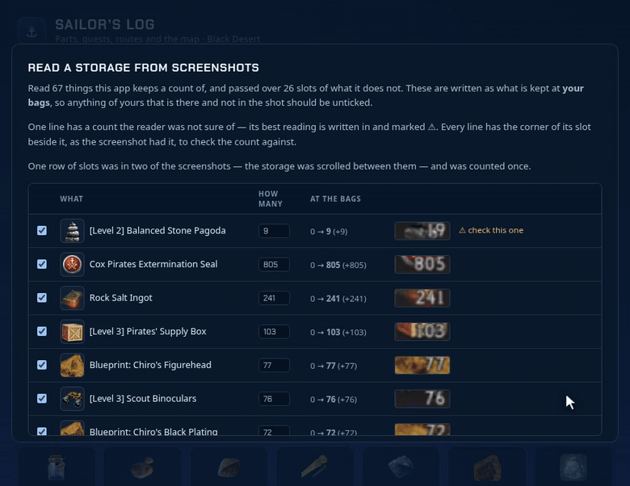

Nothing about it is typed and nothing about it is guessed. The slots are
a square lattice, found by the spacing of their own borders, so any
resolution and any UI scale read alike; each slot is then matched
against the five hundred icons the app already carries, and one that
looks nearly as much like the runner-up as like the best is left out
rather than named wrong — a storage is mostly elixirs, gear and memory
fragments, and none of that is this app's business.

The count over a slot is read off the pixels too, and no OCR engine is
fetched for a storage at all. An engine is the wrong tool here — it is
trained on a page of print, and this is eight-pixel writing over a
drawing — and so, it turned out, were templates of the game's figures:
a template is one rendering, and the same window captured by a desktop
that scales its screen, or saved as a JPEG, or drawn at another UI size,
is another. A stack of 103 over a crate came back as 1,103, because the
edge of the crate really is an upright.

What reads it now is what reads house numbers off street photographs: a
small convolutional network run along the whole line and trained with
CTC, so nothing has to say where one figure stops and the next begins.
It was taught on four hundred thousand **made-up** slots — the game's
own fonts, pulled out of the client, written over this app's own icons,
then blurred, rescaled and recompressed every way a screenshot gets —
and on no real ones, which is what makes the real ones a test. *Fonts*,
because which face draws the counts depends on the client's language:
Strong Sword on the English one, a bold gothic or a wide ShinGo on
others, and a reader taught one face took another player's 656 for 555.
It is taught every face the client ships. Five real screenshots off
two players' setups — two desktop captures, two of the game's own
JPEGs and one in that other face — 458 slots in all: **457 read right,
none wrong that it was sure of**; the one it missed has a mouse pointer
lying across the figure, and it said so. The same shots shrunk to seven
tenths, blown up by half, blurred, or scaled and recompressed are still
without a wrong count it was sure of; crushed to a JPEG of quality 35
there is one in 458. What gets harder to read gets marked, not guessed.
It is fifty thousand weights in `js/count_model.js`, runs in about ten
milliseconds a slot in plain JavaScript (`js/count-net.js`), and is
rebuilt by
`tools/count-reader`.

Every line of the table keeps the corner of its slot beside it, as the
screenshot had it, so a count is checked at a glance against the
picture it was read off. Every reading also comes with how likely it is — the share of all the ways
the line could be read that spell that number — and one the network is
not sure of, or reads differently when the slot is cut a pixel to
either side, is written in as its best reading, marked ⚠, with the
corner of the slot beside it to check by eye. A pointer parked over a
count is the usual reason. The lattice gets the same scrutiny: a spacing
the icons do not believe — every other border of a blurred shot, the
sea behind a shrunk one — is looked for again a band at a time and
settled to a fraction of a pixel by the icons themselves, and a shot
whose slots never line up has everything read from it marked.

**Scrolled shots are one storage.** Shoot a screenful, scroll, shoot
again, and the last row of one is the first row of the next. The rows
two shots share are found by their pictures — named or not, so the
elixirs line things up as well as the barter goods do — and counted
once; the table says how many. A row of one thing repeated is not taken
as proof, because two rows of dynamite look exactly like one row shot
twice. Nothing is written until you press the button, and what it
writes is one change.

### 3. Craft and enhance

The Workshop lists everything you have the materials for. Name a batch
size or take the lot; crafting moves real stock — ingredients out,
product in — and it can be undone.

Enhancement is separate, because an attempt can fail. Blue and green ship
parts keep their level when one does; the yellow Falasi and Cheongun tier
drops one, which is why Cron Stones are part of what an attempt there
costs. Record **Succeeded** or **Failed** and the materials come off your
stock either way.

Below the yellow tier an attempt takes a **failstack** too. The game
publishes no per-stack figure for ship parts, so the Workshop assumes
the standard line — a tenth of the base rate a stack, capped at 90% —
and says so; blank means the quoted rate.


### 4. Take the list shopping

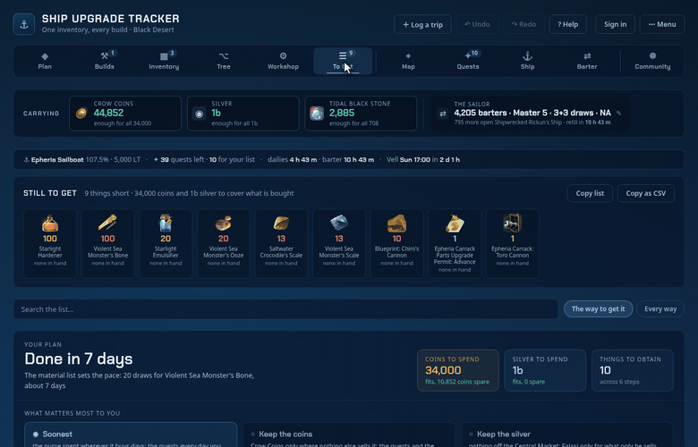

It opens on **Still to get**: the icons and the numbers of everything
short, biggest first, tinted by the money each one wants — and a press
on any of them narrows the whole screen to that one thing.

Under it, **the way to get it**: not every way each thing *can* be had,
but one way it *should* be, chosen against all the others and counted
in days. *Done in 11 days* is the headline; beneath it, what it will
cost in coins and silver, and how many things are left across how many
steps. Because there is no right answer to what that should cost you,
it asks: **Soonest** spends the purse wherever that buys a day, **Keep
the coins** spends them only where nothing else sells the thing, **Keep
the silver** leaves the Central Market alone — and the day count moves
as you choose, which is the trade in the only unit that matters. Tell
it how many days a week you actually sail, hold coins back, and say
what you are willing to do at all: turn bartering off and the lists
stop counting; turn hunting on and a sea monster's drop becomes
something to go and kill for rather than something to buy.

A barter step is paced by how often that offer was really seen on the
list, not by how often it could appear — presence only, never
multiplicity, so it can lengthen an estimate and never shorten one. And
the plan says plainly **what it will never do**, drawn from the orders
in force, so you know what it is not counting.

**Every way** is the other reading: everything outstanding grouped by
how you actually obtain it — Crow Coin Shop, Falasi's silver, barter,
worker nodes, hunting — with running totals measured against what's in
your purse. Either reading copies as text or as CSV, and prints legibly
on white.

**Total Barters follows your runs.** Recording a run adds its trades to
the count that opens the next trade route, in the same change as the
goods and the silver — one Undo takes back all of it — and a run that
carries you past a threshold says which route it opened. It stays a
field you can type over when it and the game drift apart; it lives in
the bar above the tabs, with the barter level, the Parley, the vouchers,
the Sailing Mastery, the Bos'n Jacks you have out and the region the
prices are quoted in, because they are read by every screen and not
only this one.

**And it decides which islands exist.** The game opens the trade routes
island by island as that count climbs — 600 barters opens Lantinia's
Combat Raft, 3,000 the Wandering Merchant's Ship — so nothing is ever
planned through a barterer you have not reached: chains that climb
through one are left out of the run and said out loud above the list,
a material's islands show the shut ones locked with the count beside
them, the chart lights no pin there, and a thing dealt nowhere else
reads as *locked — 2,520 more barters open the Wandering Merchant's
Ship* instead of a number of days you could not spend.

Anything the **Crow Coin Shop** sells carries a *Buy*: it asks how many,
says what that costs and what is left of the purse, and records the
goods in and the coins out as one change — so one Undo takes back both
halves. It opens on what the purse can actually cover, and a sum that
does not work is said rather than quietly clamped. The same button is in
the Inventory panel for any coin-priced thing.


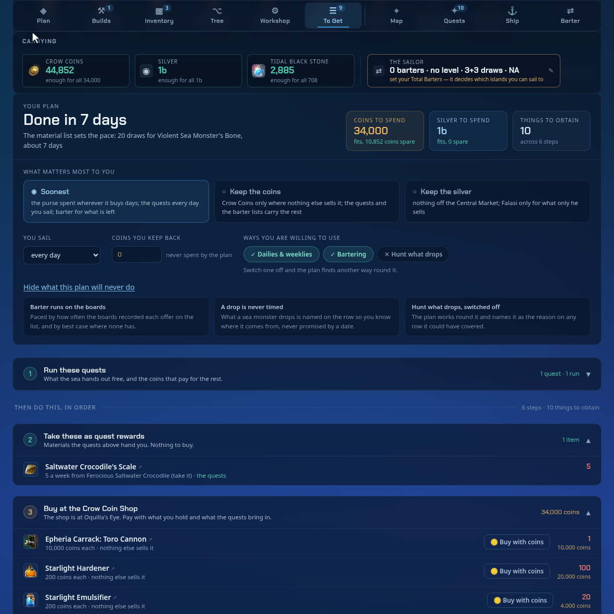

**And which way each thing *should* be got.** Every line above can say
where a thing comes from; the sources compete, and that is the question
the list cannot answer one line at a time. A Candidum daily pays
fourteen Tidal Black Stones *or* one Violent Wave Plywood, the coins
spent on plywood are not there for the tendons, and two materials off
the ship-material list wait on the same three draws a day. So To Get
opens on **The way to get it**: the whole list read at once, one way an
item — from the quests, the Crow Coin Shop, barter, Falasi, the Market,
or go and get — with its reason on the line, how many days that is,
and what sets the pace.

**It reads as steps, in the order they are done.** The quests pay the
Crow Coins that buy the shop's half, so buying first empties the purse
before the quests come round. So the plan is numbered: run these quests,
take these as quest rewards, buy at the Crow Coin Shop, barter for these
at sea, and on down to what has no rate at all. Each step says where it
happens, carries its own total, and folds away when you are done with
it. Above them, one card holds where the plan lands, the thing that sets
that pace, what it costs against what you can spare, and every dial that
moved it there — including a line you can open that says what this
particular plan will never do.

It follows a goal you state, because what is scarce is yours to say:
**Soonest** spends the purse wherever it buys days, **Keep the coins**
spends them only where nothing else sells the thing, **Keep the
silver** leaves the Market alone; beside them, how many days a week the
sea gets and coins to keep back. The quests to run are listed as the
actions they are, each with the reward the plan would take off a
pick-one — *make it my pick* remembers it, so Claimed on the Quests
screen records it in one press — and a short purse is stretched by the
coin quests, with the horizon saying how long that takes. **Every way**
is the old reading, one chip away.

Three switches say what you are actually willing to do: the dailies and
weeklies, bartering, and **hunt what drops**. The last takes every
dropped material off the shopping list without ever claiming a rate for
it, because none is published — on a two-part Carrack that is the
difference between forty-three days and thirty.

**How often the offer is really there.** Every barter figure in this app
used to assume the exchange you want is on the list each time you draw
it. It is not: of the four whole ship-material boards recorded, a
Saltwater Crocodile's Scale was on *one*. So the forecast now reads both
records that ride with the barter table — those four complete boards,
and the forty trade-list layouts seen across four hundred and twenty
refreshes — and paces every rung by how often it was actually there. The
old figure survives as the floor, with the sample beside it: *about 11
days, 5 if the offer is always up · on 1 of the 4 boards recorded*.

What is measured is presence rather than how many islands showed it, so
the change can only ever lengthen a forecast and never shorten one; a
thing on every board reads exactly as it did, and anything no board has
recorded keeps the best case and says so. Your own board diary is left
out of the arithmetic on purpose: it records where a thing was and never
where it was not, and a sample with no absences in it cannot measure
absence.

Every row also carries the ways the plan could not put a number on —
what drops it, the worker node, the bulk exchange — because *nothing
else sells it* is true of shops and false of Khan.

---

## What else it does

### Hover anything to see what goes into it

Rows, tiles, craft cards, even the build picker. Your own counts show
beside each ingredient in teal or red. An enhancement level shows the
part and the stones one attempt costs instead.


### Record a level you already reached

A part and its ten enhancement levels are one tile, not eleven. Open it,
pick the level you actually have, and it is recorded — **no stones are
spent**, because the Workshop is for attempts you are really making.


### See why a build needs a thing

The Plan is one row per material, which answers *what am I short of*. The
Tree is the same thing unflattened, and answers the other question: a
Carrack sits over the Caravel it is made from, over the Sailboat before
that, with the materials of each hanging off the step that wants them.

Enhancement chains start folded, because a `+10` pulling in `+9` pulling
in `+8` is ten rows that all say the same thing.


### Know what it will actually cost

Every part has a shop price, and none of them tell you what the thing
really costs. Open any item and it prices each route end to end: the
Crow Coin Shop's number beside what making one costs once *its*
ingredients are priced too, all the way down the recipe.

Crow Coins and silver are kept apart, because the game will not trade
one for the other, and anything with no price — bartered for, dropped —
is named rather than quietly counted as free. So a Carrack part reads as
*57,029 coins + 1b silver + 100× Violent Sea Monster's Scale*, not as a
number that hides the barter grind behind it.

Where an item can be both made and bought, both are shown side by side
with the one your plan is using marked, and neither is called the right
answer unless it beats the other outright. Each build in the queue
carries the same figure for what is left to finish it, which falls as
you record what you gather.


### Look anything up

Every item name in the app links to its page on
[BDOCodex](https://bdocodex.com/), in a new tab — in the Plan, the Tree,
the Workshop, the shopping list, and in the ingredient lists inside the
detail panel. Enhancement levels link to the base item, which is where
the level table lives.

### See who reserved what

Every material shows how much is spoken for by a build and how much is
still free, down to which build and through which recipe. When something
can be both made and bought, you choose, and the plan follows.


### And the rest

- **Undo** on every change, and a one-line **Next** banner that tells you
  the single most useful thing to do right now.
- **Sort** the Plan and the Inventory by shortfall, need, what you own or
  name; **search** on every list, the Workshop and the shopping list too.
- **The address bar knows where you are** — the tab, and the item you
  have open — so a place survives a reload and travels in a link, and
  Back retraces your steps.
- **Start fresh** clears everything behind a confirmation, and **Import**
  asks whether to replace what you have or merge the file in, keeping the
  higher count of anything counted twice. Exports are dated.
- Quantities read the way your browser writes them: `12.000` is twelve
  thousand on a German machine and twelve on an English one.
- **Your purse** — Crow Coins, silver, Sangpyeong Coins and enhancement
  stones ride along above every tab, since you spend them from every tab.
- **Export / Import** a JSON backup to move between machines — or
  **a link**: the plan rides in the address, gzipped and slimmed of the
  diaries, to look at on any browser without saving, or to merge or
  take in; the export says how long the link is and warns when a chat
  would cut it. An import names the items this version does not know
  before it asks whether to replace or merge.
- **A save that cannot be written** — the browser's storage full, or
  refusing — is said out loud, with *Export now* beside it, rather than
  lost quietly; a save that will not parse is copied aside and offered
  back as a file before anything is written over it.
- **What's new**, a release's worth of notes with a picture each, shown
  once to a browser that has seen an older version and reachable any
  time from the *Menu*. The same notes are [`CHANGELOG.md`](CHANGELOG.md).
  Neither it nor the tour interrupts someone who arrived on a shared
  link — they came to see that one thing.
- **A guided tour** that walks every section on example data, pointing
  at each thing on your own screen, then hands your own data back
  untouched — and reads a phone, where it points at the bar at the thumb
  and the menu behind it. Alongside it a **Help** film
  of the whole thing end to end, for when you would rather just watch.
  Help also lists **what changed** and **when each dataset was last
  checked**.
- **One way round.** Every section sits in a dock across the top of a
  wide screen, the icon over the name, all of them at once; on a phone
  four sit at the thumb and the last slot opens the menu. That **Menu**
  — the masthead's on a wide screen, `M` on the keyboard — is the one
  menu the app has: every section, Find, the trip log, Undo and Redo,
  your save, the help and the settings, as a drawer at the right or a
  sheet at the thumb.
- **Find** anything with `Ctrl+K` (or `/` on its own): an item opens in
  the Inventory's panel, a tab opens. The digits `1`–`9` switch tabs,
  `0` the tenth.
  Every choice the app asks for — a hull, a part and its level, a
  sailor type, the rewards to narrow the quests to, an item a trip
  brought back — goes through one picker: rows with a picture, a fact
  beside the name, a search box that ranks a name starting with your
  letters first, the keyboard, and ticks where several are wanted.
- **The masthead** keeps Find, Log a trip, Undo, Redo and the Menu,
  which holds Profiles, Export, Import, Help, Tour, What's new,
  Feedback, the theme, the water and Start fresh. The sections sit in
  three groups: the yard, where a build is planned and made, the sea,
  and the harbour. Each tab keeps the search typed on it.
- **Log a trip**: everything you brought back, in one box, as one
  undoable change.
- **Where it is**: an item's count is what is in your bags plus every
  storage you have noted it at — Velia, the ship's hold, wherever — so a
  number typed at a place moves the total, and a total typed lower comes
  off the places.
- **Profiles**: separate saves on one browser for an alt or a what-if;
  sync mirrors the main one only. The Map's routes and traces and the
  Barter tab's board and run belong to the profile too, so they export,
  sync and switch with it.
- **Look-ups in your language**: Help lets you pick the BDOCodex locale
  every item link opens in (French, German, Korean and nine more).
- Works on a phone — a tap on a row or a chip shows the hover card, a
  second tap puts it away, and a phone on its side is still a phone;
  the water shader is optional (`≈ Water` under the Menu), and so is a
  light theme (`Theme` there: dark, light, or as the system has it).
  Offline it runs from a snapshot of the last deploy, never a mixture
  of two.

---

## The day itself

The yard is where a build is planned and made. The rest of the game
happens at sea, and the last four tabs are about that: the quests it
hands out, the ship you sail, the chart you sail it on, and the run
you plan on today's board.

### What today can do about it

The plan says what is left; the **Today** strip on the Plan says what
today can do about it: the quests still open that pay in something on
your list, how long until the dailies, the weeklies and the barter
refill reset (00:00 UTC, Thursday 00:00 UTC and 06:00 UTC), when
**Vell** is next up on your servers — the EU and NA timetables as of
2026‑08‑30, correctable in place, with a reminder a quarter of an hour
before while the tab is open — and the **pace** each build has been
moving at, with the finish that pace implies. The pace is a diary kept
in this browser, not part of the save.

With a key pair configured (see below) the Vell reminder reaches a
phone with the tab closed; without one it fires while the tab is open.

### Quests: what the sea hands out free


**Quests** are a checklist. Claiming a reward puts it in stock and
ticks the quest for the day or the week it counts for; the tick wears
off at the reset by itself. A pick-one reward is remembered, so the
next claim takes the same one in a single press (an *other reward…*
link is there for the day you change your mind). Tick several quests
and **Finish** them together as one undoable change — the ones whose
choice is not yet known ask, the rest go through — and keep a set you
run every day as a named **group** (one click ticks it) or **star** the
ones that matter. Filter to what is still to do, what is done, what
pays in something your plan still wants, your favourites, or one reward
in particular — the ones on your own list are offered first; every
quest's name opens its BDOCodex page. Ravinia's log shows how many of
its letters you have recorded.

### One ship, every tab


The **Ship** screen opens on the ship as a card — and keeps **setups**:
a hull with its parts, crystal and seating under a name, to switch
between here or from the Map's route timing (the crew roster itself is
shared). Your **Sailing Mastery** counts toward speed, acceleration,
turn and brake the way the game's table has it; the card reads it, and
it is typed once in the bar above the tabs, where every screen reads
the same number.

**And the pets count too.** A **Bos'n Jack** is the one pet in the game
whose talent is ship weight — *Big Ship Inventory Weight*, +50 LT a
tier, stacking across the five pets you can have out at once, and one
step more again on the tier 5 you make your Alpha. They are yours and
not the hull's, so they are set in the same bar as the mastery: the row
of birds there is read, and one press opens the nest — five slots down
the side, the six tiers across, a head row that sets all five at once,
and the whole thing a draft until Save. The hold counts them on the
Epheria line, the Carracks and the Panokseon, and on nothing smaller —
which is what the talent's own *Big Ships only* means — and the Ship
screen shows them as their own line in the sum.

**Your fleet is your inventory.** Keeping a setup puts its hull in the
Inventory if none was recorded there, and a hull recorded in the
Inventory is a ship in the fleet — listed under *Your fleet*, ready to
sail, and counted on the community boards — whether or not a setup was
ever named for it. One Undo takes back both halves; a hull dropped from
the fleet comes out of the hold.

The screen fits the hull out as five slot cards — the four parts and
the **sea crystal**, every one of the codex's 287 variants from Eltro to
Rusalka plus Ebenruth's Nol and the Oceanteared Nol, chosen by grade
with its effect beside the name and added to the hull's numbers: each
slot takes the best part you hold by itself, or one you choose — a part
you own but have not recorded, or a plan you are weighing, marked as
such, and recorded in your inventory with one press. The roster can be
ticked for a bulk recover, disembark or dismiss, and the hull, its
parts and its crew travel in a link of their own.

From that one setup follow the speed the Map times a route at, the hold
a run can carry once the crew's own weight is aboard, and the "Your
ship" tile on the Plan.

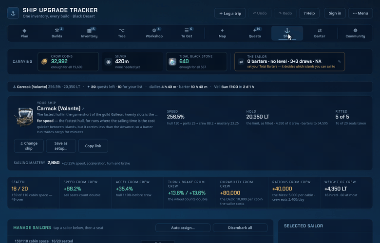

**Your build in a link.** *Copy link* on the ship card carries the
hull, its four parts, the crystal, the roster and the seating in one
address. Opened at the other end it says whose ship it is and what is
on it, marks each part the reader already holds, and offers *Make it my
ship* — or queues the missing parts as builds, so the Plan prices the
way to it. Looking costs nothing; taking it is one change, and one Undo
takes it back.

**Auto assign asks what the boat is for.** There is no best crew, only
the best crew for something: a seat's whole effect is a *second copy* of
what it doubles, and the Sail doubles Endurance and Wits together — so
adding the pair and taking the biggest sum puts a 1.1-speed sailor where
a 3.9-speed one should have been. Pressing it lays out every goal —
speed, acceleration, turn, brake, cannons, all round — with what the
crew would come to under each against what it comes to now, and one
press arranges the roster: who comes aboard as well as who sits where,
since a hull's cabin space is a knapsack. The sailor list can be ordered
by any growth, with the figure shown on each card.

**Sailors' real numbers.** Growth is a hidden random range per sailor,
so the type's figures are averages. The Ship screen lets you type what
the sailor window shows for each stat, and everything downstream — the
hull's speed, the route's minutes — follows the typed number. On a full
Carrack the difference between the average and the real rolls is over a
point of speed, which is the whole gap between the app's figure and the
game's.

**Or read the crew off a screenshot.** *Read screenshots* on the sailor
list takes the game's own windows — Manage Sailors whole, or a cropped
Selected Sailor panel, or a mixture — and comes back with names, levels,
condition and every growth in a table to check before anything is
written; a sailor already on the roster is brought up to date rather
than hired twice. Twenty at a time. The window never prints a sailor's
*type*, so it is worked out from the appetite, the cabin cost and the
weight, and where three types share all three (Confident, Tough and
Tenacious all cost five cabins and 300 LT) from where the growths went —
with anything less than certain marked for a look, and a dropdown to
correct it.

**In any language the game runs in.** Say which of the sixteen the
client's own menu lists is yours and the reader speaks it: 식성 and
生活物資 and Требуется кают are labels like any other, and a Cyrillic,
Hangul, Han or Thai name comes back as the name. The ten Latin services
read on the model already aboard; Русский, 日本語, 한국어, 中文, 繁體中文
and ภาษาไทย each fetch one to three megabytes more, once. Under the
words is a shape none of the sixteen change — the weight carries LT, the
condition is a pair over a slash, and the eight growths sit in the same
order whatever they are called — so a label the scan could not make out
costs nothing: the figure is still the fifth down the column.

It is read **in the browser**: Tesseract is vendored under `reader/` and
served from this origin, the shots are decoded by the browser's own
image decoders and handed on as pixels, and nothing is uploaded — so
there is no file on any server to delete afterwards, and it works
offline once the engine has been fetched the first time (about 6 MB,
cached across deploys). The page's Content-Security-Policy gains
`'wasm-unsafe-eval'` for it, which admits WebAssembly and nothing else.

### The chart, and what it draws


**What the chart draws** is one strip of switches — *On the chart* —
above the panel's tabs rather than inside any of them, since it is the
same question whichever tab is open: barterers, habitats, wharves,
guild wharves, island names, traced routes. It folds away when it is in
the road, and a phone starts with it folded. The five tabs are named
for what they do: **Barter** (who has what you are short of),
**Route** (plot the loop), **Draw**, **Grounds** (monsters and
community courses) and **Today**; the side panel sits on whichever side
you like.

The chart draws the game's own **habitat markers** — each species'
picture from the codex at the centre of its grounds, "Hekaru Habitat",
"Young Sea Monster Habitat" — which are also in the *Showing* picker.
Every spawn point is kept to open water — the codex draws a region's
spawns as a grid that runs straight over islands — and each marker
stands at the centre of a species' spawn cluster, on the water; markers
that would print on top of one another at a given zoom share one
picture with a count. The Lyngbakr Habitat of the 27 August 2026 patch
is twelve positions bookmarked on the game's own map, north of the
crocodiles' old ground (the Nineshark and Black Rust spawns the codex
still lists in that old ground are left out), and the crocodiles' new
ground is placed off the game map's icon north-north-west of Cheongsa
Island, roughly, until the codex carries it. Two community maps are on
the chart too, fitted to it on their island names: Awabi's *Road to
Cox* — the Cox Pirates' camps (six to eight seals), flags and cargo
ships, a group of their own on the Grounds tab — and Vell's waters from
gpw's ocean map. The chart can also draw all 58 **wharf managers**
(repair, rations, sailors) and guild wharves, named by harbour, and
**island names** faintly once it is close enough to read them. The
chart's `⇩` keeps the area in view offline — its tiles and one zoom
level either side, up to 400 of them — in a store the service worker's
tidying never touches, until `⌫` lets them go.

### Stand the chart up

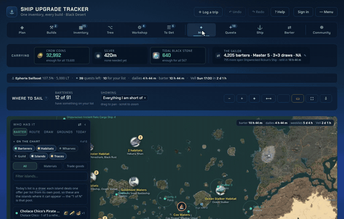

The `⛰` button takes the chart off the flat and stands it on **the
game's own terrain** — not a picture of the world map, but the terrain
meshes read out of your client and baked into a heightmap the browser
can draw. Shift-drag leans it; `⤓ Level` looks straight down again,
facing north. Two ways to paint it: **Ground**, in the colours the
client ships on the terrain itself, and **Neon**, contours drawn the
way the game's own 3D map draws them. Every pin, route, habitat and
trace you had on the flat chart is still there, standing on the
landscape it belongs to.

The terrain is a build artefact, not something the app fetches from
anyone: `tools/build-terrain.mjs` bakes it out of an extracted client,
and a deployment without that bake simply has no `⛰`.

### Plot the loop, and know how long it takes


**Routes** say how long. Every leg on the Map's Route tab carries its
length and the minutes it takes at the speed that ship actually makes
— hull, parts and sail seats — over the line as it is bent round the
land. What 100% is in metres the game never says, so every time is a
range: a fifth either way around the chart's 11 m/s estimate, a tenth
either way once you have timed one leg and told it. A leg sailed
overweight is slowed — the game gives no curve, so the chart takes a
straight line from full speed at the limit to half at the overload
cap, says so on the leg, and the total follows. A leg the router
cannot bend round the land is drawn straight, dashed in red, and named
in the panel as a floor rather than a reading. The **Rations** line
does the same for the pool: what the run eats of it and what is left,
from the crew's appetite and an estimated drain under sail (6,000 a
minute, replaceable by watching the pool over one leg), and when it
would run below a tenth before the end, the stop it runs low after and
the nearest wharf manager to call at, put into the run at one press.
Parley is costed at
one trade a stop or at every attempt the offer allows; the stops past
what your bar covers are marked and a button trims to them. The trade
goods aboard — the hold and the bags, not a harbour's storage — are
read against what each stop hands over. Eight routes are kept by name
and never dropped unasked (a ninth asks which makes room), a replaced
route is kept as the previous one in a slot of its own, a route
travels in a link, and a ruler (`⟷`) measures any two points on the
sea, with the game's own coordinates under the pointer. The Route tab
names the nearest wharf to the last stop.

### Draw a route the list cannot express


The **Draw** tab is for routes the barter list cannot express: pick
*Add stops* and click the sea, *Draw* and drag a line, or *Write* and
type a word straight onto the water — every point is a place on the
chart, so it all zooms and pans with the tiles. There are eight inks,
three pen widths and three sizes of writing, and while the tab is open
the chart's own markers stop answering, so a line can be drawn across a
barterer without opening his trades. Undo walks back through stops,
strokes and words in the order they were made, and a stop or a word
already down is dragged where it belongs — a word tapped rather than
carried opens to be retyped. Each stop takes a note; a trace is kept by
name, travels in a `#trace/` link or a JSON file, and its stops go into
the game's world map like a route's — with the written words as extra
favourites. Legs are **bent round the land** by the same router the
barter route uses — two stops with an island between them are not a
straight line — and a stop clicked onto a headland steps off it,
because a stop is a place a hull can float; *Straight legs* turns the
routing off.

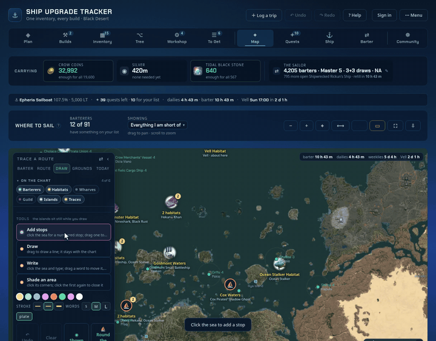

**A drawing in a link.** *Copy link* puts the whole trace — stops,
notes, line and words — into one address, and whoever opens it gets the
chart flown to the drawing, on any browser, with nothing of their own
touched. The link carries the drawing itself, not a pointer to it, so
it works for someone who has never opened the app before; a trace taken
in this way is on the water like one drawn here, to draw on or keep.

Up to twenty traces live on a shelf below, each drawn small with what
it holds and when it was kept: open one to draw on it, rename it, copy
a link to it, or open its **eye** to lay it over the chart beside
whatever else you are drawing. The shelf keeps to the newest few and
whatever is on the water; **Browse all** opens the library, which has
the room for a search (names, notes and the words written on them), a
sort, and every trace as a card.

### A run on today's board

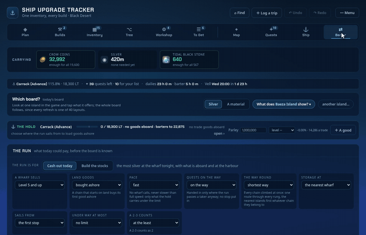

The trade-goods barters are not rolled island by island: every refresh
the whole sea shows one of forty fixed layouts, which a community
record of nearly two thousand refreshes writes out island by island. So
the **Barter** tab asks what *one* island is showing — tap it from that
island's possible offers, the one that tells the layouts apart best is
suggested — and the whole board follows: every chain the day allows,
listed by how far it reaches and what it pays, and the ones ticked are
one run. The hold is what is actually aboard, weighed against the ship
as fitted and the ceiling the islands still deal under; the sailing
orders say what the run is for, which levels a wharf sells and at what
pace; and a strip along the foot keeps the run in a line. *Lay it out*
opens every stop, what to buy before casting off and the quests handed
in on the way; *Sail this run* draws it on the Map, where the chart's
panel becomes the run sheet and each stop is ticked off as it is dealt.
*Record the trip* at the end puts the whole of it in the Inventory as
one undoable change. The details — the material run, the three paces,
the quests that come along, the wharf calls — are under
[What's covered](#whats-covered).

**A run buys only what the Central Market has.** A chain that starts on
land starts with something bought, and the Market's last price stands
when nothing is listed — so a run could tell you to load five hundred of
a good nobody is selling. The relay brings back how many are listed with
every price, and with land goods *bought ashore* the run is held to it:
no more of a good than are listed, and a chain whose first good has
none cannot be ticked: its card is greyed and says *none on the Central
Market* on its own face, with the good drawn. Where you hold a good
part-way up the same climb the card starts from that instead — the
shore is struck out among its starts, with the reason — and where you
keep the land good yourself it offers *from my storage*;
and *Before casting off* shows the count beside each thing to buy. A
count the Market would not confirm holds nothing back, and the Market is
asked again every half hour while the page is open.

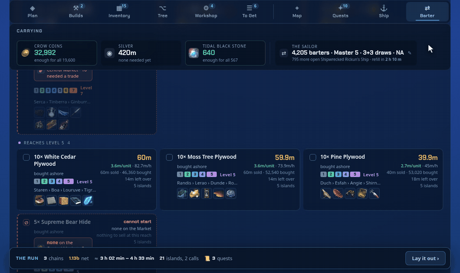

*The Market in that clip is made up, with every third shelf bare — a
machine shooting a clip cannot wait for Essence of Liquor to sell out.
The chains, the run and the card are the app's own.*

**Or screenshot the window.** *Read the window* takes a shot of the
barter list and answers every island in it at once: the island at the
start of each row, what it takes and what it pays, matched against the
exchanges the codex says that island deals — so a name the window cut
short (`[Level 5] Faded Gold Dra...`) is as good as a whole one, and a
misread letter cannot invent an offer the game never showed. Six rows
off one screenshot are usually enough to settle which of the forty
layouts the sea is on. A row two exchanges fit equally well is a list to
pick from rather than a guess, and the islands that pay ship materials
go to the material list instead, since those roll on their own.

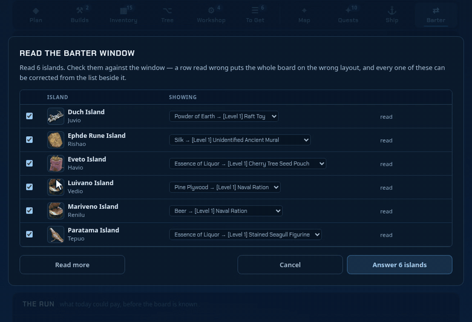

**And a board is the same for everyone until the refill.** Where sync is
configured you can *tell the fleet* what you read — from the screenshot
dialog or from the bar, however the board was answered — and it goes up
with your name on it, for anybody who opens the page today. The bar says
what others have read of today's board and how many have since seen the
same; *take their reading* answers every island they named and tells
them so. A reading is yours to take back and the operator's to hide, and
an account shown anonymously on the community boards is anonymous here
too. This is also what to do when the bar says **no layout shows that**:
the record the app ships is a snapshot, the game edits a slot at a
maintenance without renumbering anything, and a board nobody has on file
is exactly the one worth passing on.

**The layout book is where the evidence is kept.** The bar asks one
question — which board is it today — and is no place for forty layouts
and two months of readings. *📖 The layout book*, on the bar, opens them
in a view of their own: every layout on file as a card, with the land
goods its [Level 1] islands are asking for and the goods its coin
islands will take drawn on it, how many exchanges it pays at each level,
how often the record has seen it and how often the fleet has. A reading
that pins one layout counts for it; a reading three layouts fit counts
for none. Above them are the **boards nobody has on file** — read by
sailors, fitting nothing — each with who read it, how many others saw
the same, and the layout it is nearest to: parting at a slot or two is a
layout the game has edited, parting at twenty is a new board or a slip,
and the count beside it says which to believe. A card opens into the
whole board, island by island with the goods drawn, marked where it
agrees or disagrees with what you saw today and where your barter count
has not opened an exchange; a board seen today can be taken as today's
from there. Search finds a layout by an island, a good, or its number.
Readings are kept two months for this, since a layout comes round every
few weeks.

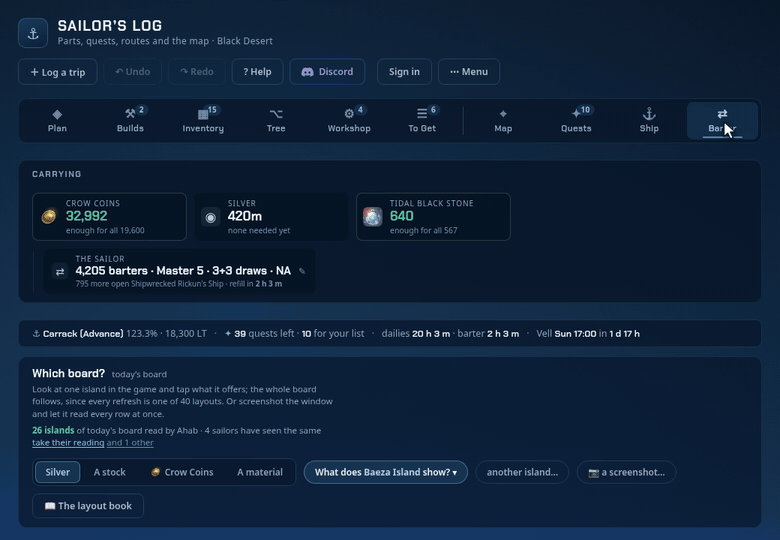

*The readings in that clip are invented, like the sailors on the
community boards and for the same reason: this project runs no public
deployment to film. The book, its sums and the layouts are the app's
own.*

**The record is not the last word.** The community's record has no row
for an island or two on most layouts, and the game's own table says why:
on that layout the island is shut to everyone — the exchange is gated at
a million barters — so nobody ever wrote down what it showed. Where the
client does deal a row the record lacks, ten of them, the layout is
handed on with it (`tools/build-barter-gates.mjs` bakes the client's
pools into `js/barter_gates.js`), marked *game files* in the book until
somebody has seen it. Once a board is settled, **✎ An island shows something
else…** is the one door for everything the record can get wrong: name
the island, then pick what its window shows — from every exchange the
codex and the client know it to deal — or that it shows nothing.
Islands whose exchange is above your barter count are greyed with the
count that opens them, because a blank window there is the game and not
news. If what you saw fits one layout everywhere but an island or
three, the board *is* that layout with those islands as you saw them —
the game moves a slot at a maintenance without renumbering — and the
run is planned on it. **Telling the fleet is offered only then**, or
when nothing fits at all: a reading that matches a layout on file is
not news, and a reading in the book is held up against every exchange
the game is known to deal at that island, so *known here, on another
layout* is told apart from *never seen here*.

**Which layouts come up most.** The app writes a board down by itself
the moment it is settled — the day and the layout, in your own save. The
book's *Yours* shows the boards you have been dealt, the commonest
first; and for those who take part in the Community tab the counts are
added up fleet-wide under *Barter layouts most dealt*, beside each
layout's share of the community's own record.

### The harbour

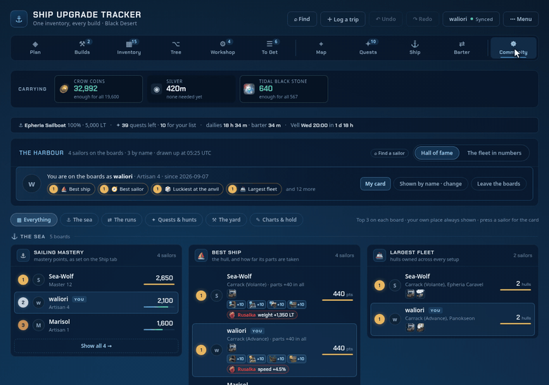

Where the deployment has sign-in there is a **Community** tab: sixteen
boards drawn from the sailors who chose to be on them — mastery, the
best ship, the best sailor, the most silver from runs, the most sea
monsters hunted, the luckiest at the anvil — and the whole fleet added
up, hull by hull and island by island. A place on a board is a door: it
opens that sailor's card, and the card stands the **Ship tab up on
their boat**, fully fitted and crewed, to look at and not to keep, one
press back to yours.

Taking part is a choice made once, by name or as an unnamed sailor, and
you are shown the digest that would be published before you agree. What
is shared, what never is, and how to turn any of it on are under
[The community boards](#the-community-boards).

*The sailors in that clip are invented — this project runs no public
deployment to film. The tab, the digest and the ranking are the app's
own, working on a fleet that does not exist.*

---

## Running it

```bash
git clone https://github.com/waliori/bdo-ship-upgrade-tracker.git
cd bdo-ship-upgrade-tracker
npm install
npm start
```

Then open <http://localhost:8000>. Set `PORT` to use another port.

`npm test` runs the suite: the sync API against a throwaway libSQL file,
and the browser half driven in a real Chrome.

`/healthz` answers with whether the database is reachable, how many
saves are waiting to be flushed, the running version and request
counters — `200` when all is well, `503` when a configured database is
down. The container's health check reads it. Every non-static request
is logged as one JSON line (`LOG_REQUESTS=0` turns that off).

`npm run backup [file]` dumps every table to JSON and `npm run restore
<file>` puts them back, upserting; stop the server first, since the
copies it holds in memory would otherwise win.

`node tools/build-shell.mjs` rewrites the service worker's precache
list from the import graph; the test suite refuses a module left out.

`node tools/build-changelog.mjs` rewrites [`CHANGELOG.md`](CHANGELOG.md)
from the release notes in `js/about.js` — the same ones the app shows
under **Menu → What's new**; the suite fails if the file is stale.

`npm run capture` re-shoots every picture and clip in this README, and
both cuts of the film, by driving the real app in a headless Chrome —
so a screen that changes never leaves the documentation quietly lying
about it. See [`tools/capture/README.md`](tools/capture/README.md).

### Docker

```bash
docker compose up -d
```

or, without compose:

```bash
docker build -t bdo-ship-tracker .
docker run -p 8000:8000 bdo-ship-tracker
```

`docker compose` picks up a `.env` if there is one; plain `docker run`
needs `--env-file .env`. Neither is required to run the tracker itself
— see [Syncing across devices](#syncing-across-devices).

---

## What's covered

**Ships** — Epheria Sailboat, Improved Epheria Sailboat, Epheria Caravel,
Epheria Frigate, Improved Epheria Frigate, Epheria Galleass, Carrack
(Advance / Balance / Volante / Valor), Panokseon — and the small craft:
the Epheria Cog by either of its two designs (Falasi's permit and land
materials, or the Fallen Vell Pirates' four bartered ones), the three
rowboats and the Raft.

**What each hull is** — durability, rations, weight limit, inventory,
cabin space, sailor seats, cannons and reload, and the four movement
percentages, read off each hull's codex page. The Builds screen shows the
line under every ship; the **Ship** screen shows the lot.

**What each part does** — the equip effect of all 72 enhanceable parts at
every level from +0 to +10: speed, acceleration, turning, braking, DP,
damage reduction, weight, rations, durability, cannon damage and reload.
The Workshop says what the next level adds beside every attempt, the hover
card says what a part does at the level you hold, and the Ship screen
sums the best part you own in each slot onto the hull — the answer to
"is +8 worth it" in the game's own numbers.

**The crew** — the twenty sailor types with their race, cabin cost,
appetite, weight and per-level growth, and where each is hired; the seven
positions and what each doubles; condition and sickness and what mends
them; the experience split; the three first mates; where the sailor slots
come from. Plan a crew against a hull's seats and cabin space, see the
contracts priced, and put the certificates on the shopping list.

**Carrack parts** — all 16 of the craftable Chiro parts (Advance,
Balance, Volante and Valor × cannon, sail, figurehead and black plating),
including their processed materials, the blueprints from the Al-Nahad,
Racid, Lerao and Tinberra worker nodes, and the full enhancement chains.

**Panokseon parts** — Haemo's four green parts and the Byukgye's Enhanced
blue parts they become, with their blueprints from Dallae Pier Quarry and
the permit from Moodle Village Shipyard.

**The yellow tier** (August 2026) — the 16 Falasi Carrack parts and the
four Cheongun Panokseon parts, each consuming the `+10` blue part of its
own variant, with the three new coral materials, the Lyngbakr drops under
them, the five-billion-silver permits, and Sunset Tidal Black Stone at a
hundred Tidal Black Stones each. The blueprints are modelled as the
exchange they are — two Sunset Coral Essence each from Falasi, four from
Gangman — so a part shows the twenty essence behind its ten blueprints
rather than stopping at the blueprint.

Recipes were read off the workshop designs rather than the patch notes
alone, because the notes write one recipe for all four Carrack variants
and leave it open whether the Chiro part has to match. It does: an
Advance Falasi cannon takes an Advance Chiro cannon and an Advance permit.

**Free from quests.** Ravinia's Ship Upgrade Log — fifty of each Upgrade
material and twenty Tidal Black Stones over its seven days — and the Old
Moon Guild's dailies and weeklies, the soldier's dailies at Oquilla's Eye
and the supply runs, with their exact rewards. The shopping list puts the
ones that pay in what you are short of first, and one press records a
claimed reward in your stock.

**The Market.** What Falasi and the Crow Coin Shop sell is priced from
their lists; what only the Central Market sells — plywood, ingots, saps —
is priced from the Market itself, per region, relayed by the server from
the community market API and remembered so the plan stays priced offline.
The region is the sailor's own — a chip in the bar above the tabs, beside
the barter count — and it says how old the numbers are and lets you ask
again from wherever you are standing.

**Mass Process** can be ticked when recording a craft of the yellow
materials, so the Black Stone Powder it takes leaves your stock too.

**What enhancement really costs.** Every enhanceable part carries its real
per-level success rates, and the Agris Essence pity caps that guarantee an
attempt after enough failures. So the plan budgets what the climb will
actually take rather than assuming every attempt lands — for a blue
Carrack part that is the difference between 500 stones and about 5,600 —
and the Workshop tells you the odds in front of you and the most it can
possibly cost.

The yellow tier changes the arithmetic, because a failure there takes a
level rather than just durability. The Agris meter belongs to the step
and is only spent when that step succeeds, so falling past one leaves it
where it was — but the level below has to be climbed again from a meter
the last success reset. Compounded over ten levels that runs to around
52 million Sunset Tidal Black Stones, which is why Cron Stones are
counted as part of what an attempt costs rather than as an optional
extra. Protected, the same climb is about 72 stones and 30,000 Cron.

A yellow row in the Workshop has three buttons, not two: **Failed — no
Crons** records the attempt that was made unprotected, spending the stone
and dropping the part a level. And because the yellow rates scale with
the failstack you bring, you can type yours in and every yellow forecast
follows it; blank means the stack the quoted rates assume. Each row also
keeps score — attempts won, attempts lost, stones spent — from the undo
history.

**Bartering** — the whole barter table as it stands: 91 barterers and
4,397 exchanges across Levels 1 to 7, including the ten coastal barterers
the April 2026 patch added (Olvia Coast, Arehaza, the Epheria and
Sanctuary outposts, Sausan, Dallae Pier, Haemo, Grándiha, Starry Midnight
Port and Crow's Nest), on a chart that reaches their shores. Every barter
line says what the exchange hands over and what those goods would have
sold for; the Route tab says how many goods of each level your hull holds
per run; a route can be exported as a small JSON file and imported again,
or written straight into the game's world map: **Put it on the game's
map** hands you the `<WorldMapQuickScreenPosition>` block for
`Documents\Black Desert\UserCache\<account>\gameVariable.xml`, the
stops numbered in sailing order as Favorites (five, with the next ten on
the map's camera slots), each with a locate button in game. The game
caps Favorites at five, so a longer route can instead be written as one
of the map's three navigation loops, which is a list rather than a set
of slots and holds every stop in order. It is one or the other, never
both — whichever you do not write is left exactly as it was, loops in
the other slots included. The Grounds tab writes the same way: the
courses and monster grounds you have ticked, several courses sailed as
one run. The file reads back too: paste its favourites block, or a few
lines of it, or open the file, and the bookmarks, camera slots and loops
come onto the chart — as the route when their points sit on barterers
(wharf calls included), as a kept trace otherwise. The chart itself can
be put over the whole screen; on a phone that is the whole screen, in
landscape.

The material list is the run for **several materials at once**: tick
the islands showing each material you are after, each with its own
want, and one run sails for all of them -- one route through every
island ticked, whatever each deals, in the shortest order from the
harbour, a give kept at another harbour's storage loaded on the way
with a wharf call before the island that needs it, and a choice between
coming home once the wants are met and sailing every island ticked. The
hold is the constraint: the gives weigh a thousand a piece and the
materials nothing, so a run leaves heavy and comes home light, and the
run's pace says what happens when every give does not fit at once. The
*full* pace sails everything ticked -- what the run will not spend is
left in storage to make room, the hold is loaded to the barter ceiling,
and the run goes out in several departures, back to the harbour for the
rest between them; the *fast* pace sails once, under the limit the ship
still sails at full speed under, and lists what stays ashore. Before
casting off, the run lists what it hands over that is not aboard yet:
the Gold Bars a few islands take, bought ashore and priced; a give kept
in a storage the run cannot load from, to bring to the harbour first;
and, for what is held nowhere, the way to the item board.

A run is sailed on the **Map**. *Sail this run* draws the route on the
chart and the chart's panel becomes the run sheet: the numbered rail,
each stop's trade and count, the hold and the Parley after it, the wharf
calls with what is left in storage, the quests handed in, Done, and
Record the trip at the end. A stop's name flies the chart to it; Done
steps the chart on to the next; a pin pressed on the chart brings its
stop up the sheet. The plotting tools fold under it. The Barter tab is
where the run is chosen; the Map is where it is sailed.

The silver run has three paces, compared in numbers under its tiles
so the choice is made on silver, minutes and calls rather than on a
word. *Fast* keeps the hold under the limit and makes no wharf call, so
the hull never slows. *Full, never slower* does every attempt the
islands allow and leaves the surplus at a wharf before the hull would
slow — more calls, full speed. *Full, loaded* does every attempt and
takes the hold up to the barter ceiling — seventy per cent over the
limit, the same point the hull stops moving at — sailing slower for it,
and calls at a wharf only where the next island would not deal. Under every stop the hold reads as the game's
Ship Info does — everything aboard, crew included, over the limit —
and beside it the Parley bar counts down from what it holds now, priced
at your barter level, a Crow's Trade Voucher drawn on where the bar
cannot pay and its two-hour cooldown allows.

The silver run has a way round among its orders. The shortest way
climbs every chain ticked at once: one route through every rung, each
still after the rung beneath it in its own chain, so the ship deals the
nearest island it holds the give for whatever chain it belongs to --
the [Level 1]s off the harbour, then the [Level 2]s. The chains go in
lots, as many at once as the hold carries with every top keeping at
least half its attempts, the tops sold before the next lot, and within
a lot the hold is shared out before casting off. Chain after chain
climbs each to its top before the next. The route is built nearest-first and shortened by
moving runs of rungs wherever they save distance without passing a
rung they depend on.

The quests come along, under an order of the run: none; on the way
only, handed in where the run passes anyway; with a short way round, a
stop put in for a taker close by; or those and the hunts. The sailor is taken to have
accepted them already, so what counts is where each is handed in, and
every taker is placed on the chart. The run hands in whatever it
passes and puts a stop in where a taker lies a short way off the
route; a hunt at a stop of its own on its grounds and handed in after; a barter quest
only once the run's trades make its count up, the count kept from run
to run and made up by itself when a trip is recorded. A stop ticked
off on the checklist hands in the quests at it.

The tab is one column: the board, the hold as a line that opens over
the page, the run's orders and figures, then what is on offer -- the
chains as cards, or the material list. The run laid out is a sheet over
the page: while anything is ticked a strip stays along the foot of the
window with the run in a line, and opens the whole of it, so the
answer is never out of sight and never in the way of the ticking.

Every line the chart draws, and every loop it writes, is bent round the
land in its way: `tools/build-seamask.mjs` reads the shipped tiles and
records which parts of the chart are sea, and a leg that cannot be
sailed straight is searched over that mask and reduced to the few turns
it actually needs. The chart's
pixels are the game's world position divided by 25, checked against the
client's own positions for the barterers to within a pixel.
The day-forecast paces each of the game's two refresh lists on its own
clock, which is what makes its "at best" honest.

Crow Coin prices were checked against the shop at Oquilla's Eye on
2026‑08‑25. The yellow tier is from the 2026‑08‑26 patch notes, with the
rates and Cron prices cross-checked against BDOCodex.

---

## How your data is stored

Everything lives in your browser's `localStorage` under
`bdo-tracker/v2` — one object holding your stock, your build queue, your
craft-or-buy choices and an undo history. It syncs across tabs, and
**Export** writes the same object out as JSON.

By default there is no backend. Clearing site data clears your progress,
so export if it matters to you.

If you used an earlier version, the first load offers to bring your
per-ship counts across into the shared inventory.

---

## Syncing across devices

Optional, and off unless you configure it. The public site and any plain
`npm start` behave exactly as above: no account, no database, nothing
leaves the browser.

Given a Discord app and a [Turso](https://turso.tech) database, the
server also offers a **Sign in** button. Signing in stores one copy of
your inventory under your Discord account, so the phone you check on a
boat and the desktop you plan on hold the same numbers.

What it does and does not do:

- **Your browser stays the source of truth.** Sync is a mirror. Offline,
  or signed out, or with the server down, the tracker works unchanged.
- **`identify` and nothing else.** The Discord scope covers an account
  id to file the save under and a name to show in the header. No email,
  no server list, no messages.
- **Stock, builds and craft-or-buy choices.** Your undo history and local
  preferences stay in the browser, where they belong.
- **Conflicts are a question, not a guess.** Every save carries a
  revision, and a push built on a stale one is refused. When two devices
  have both been edited you are shown what each holds and asked which to
  keep — merging counts would invent a number that was never true. The
  copy you do not keep is one **Undo** away.
- **Deletable.** The account menu removes the stored copy and the account
  record with it. What is in your browser stays.
- **Sessions are a signed cookie, good for 30 days.** There is no session
  table, so a session cannot be revoked from another device — signing out
  clears that browser and nothing else. The trade is deliberate (no
  round trip per request, no rows to expire); if a machine you signed in
  on is lost, rotating `SESSION_SECRET` signs every device out at once.

### Setting it up

Copy `.env.example` to `.env` and fill in five values. Both `npm start`
and `docker compose up` read that file on their own:

| | |
|---|---|
| `PUBLIC_URL` | where your deployment answers, e.g. `https://sail.walior.it` |
| `DISCORD_CLIENT_ID` / `DISCORD_CLIENT_SECRET` | from a [Discord application](https://discord.com/developers/applications) → OAuth2 |
| `TURSO_DATABASE_URL` / `TURSO_AUTH_TOKEN` | from `turso db show <name> --url` and `turso db tokens create <name>` |
| `SESSION_SECRET` | any long random string — `node -e "console.log(require('crypto').randomBytes(32).toString('hex'))"` |
| `VAPID_PUBLIC_KEY` / `VAPID_PRIVATE_KEY` | optional, for Vell reminders by push — `npx web-push generate-vapid-keys`; needs the database, not Discord |
| `ADMIN_IDS` / `FEEDBACK_WEBHOOK_URL` | optional: the Discord account ids that may read the feedback inbox, and a webhook that gets a copy of each entry |
| `UPLOAD_DIR` | optional: where screenshots sent with a report are kept — `./.data/uploads` by default, which the compose volume already covers. `FEEDBACK_IMAGES=0` turns them off |

Then check it before opening a browser:

```bash
npm run check
```

That asks Discord whether the client id and secret are a real pair,
connects to the database and creates the schema, and prints the exact
redirect URI to register. It never prints a secret.

Register `PUBLIC_URL` + `/auth/discord/callback` as a redirect URI on the
Discord application. To develop locally, add
`http://localhost:8000/auth/discord/callback` as a second one and point
`TURSO_DATABASE_URL` at a file — `file:./.data/tracker.db` — which needs
no Turso account at all.

Leave any of it blank and sync stays off, which is a deliberate
half-configured deploy falling back to the safe behaviour rather than
failing at the first sign-in.

`.env` is gitignored and excluded from the Docker build context, so the
secrets are never committed and never baked into an image -- compose
passes them to the container at run time. With plain `docker run`, hand
them over yourself:

```bash
docker run -p 8000:8000 --env-file .env bdo-ship-tracker
```

### Run exactly one of it

With sync on, the server keeps the current revision of every save in
memory and answers a push from there — that is what makes saving feel
instant, and it is only correct while **one process** owns the data. Two
instances behind a load balancer would each believe they held the current
revision, both would accept a push built on it, and one player's work
would vanish without the conflict dialog ever appearing. Scaling out
means moving that check back into SQL first.

One VPS with a proxy in front of it is exactly the shape this is built
for. Behind Cloudflare or nginx, two things are worth knowing:

- **Do not cache `/api/`.** Those responses are one account's, told apart
  from another's only by a cookie. The server sends `Cache-Control:
  no-store` and `Vary: Cookie` on every one of them, so a generous cache
  rule cannot serve one player's inventory to another — but do not add a
  "Cache Everything" rule that overrides it either.
- **Rate limiting is per account here**, not per address, because behind
  two proxies the client's address is several headers deep and easy to
  get wrong. Address-level abuse — sign-in floods, one noisy host — is
  the proxy's job, and it is much better placed to do it.

### Feedback

**Menu → Feedback** is a form: something is wrong, an idea, or something
else, with the section you were on, the build and the browser attached.
Wherever there is a database it lands in a table, and when
`FEEDBACK_WEBHOOK_URL` names a Discord webhook the operator gets a copy
the moment it arrives. On a browser-only copy there is no inbox, so the
same dialog opens an issue on GitHub instead — that link is there in
every case, for anyone who would rather write in public.

A report is a post rather than a line. The words take the handful of
marks everyone already types on Discord — `**bold**`, `*italic*`,
`` `code` ``, `> quoted`, `- lists`, `1. steps`, `~~struck~~`,
`||spoiler||`, `[words](link)` — with a bar of buttons over the box and
a **Preview** beside them. A link that is the whole of its own line and
points at YouTube or Streamable becomes the film, which loads nothing
from either host until the play button is pressed. Nothing anyone
writes is ever trusted as HTML: `js/markup.js` escapes the source first
and then applies its grammar to the escaped text, so every tag in the
output was put there by that file.

Screenshots come with it — up to four, pasted, dropped or picked. The
browser shrinks each to 1600 pixels on its long edge before sending, the
server reads the type out of the bytes rather than believing the
filename, and the picture is then served only to the account that sent
it and to the admins. The bytes live on disk under `UPLOAD_DIR`
(`./.data/uploads` by default, which the container already holds a
volume over); the row that says whose it is lives in the database, and
an upload attached to nothing is swept after a day.

Sending needs an account. A report worth answering is worth being able
to answer, a screenshot has to belong to somebody before it can be shown
to anybody, and the ceilings have to be counted against something: one
report a minute, four open at once, ten a day. Signed out, the dialog
says so and offers the GitHub link. The operator is outside all three.

The accounts listed in `ADMIN_IDS` get **Feedback inbox** on the same
menu: what came in, open first, filtered by kind, each post rendered as
it was written with its screenshots where they were put — a click fills
the screen with one — and a button to mark each done or throw it away
with its pictures.

### The community boards

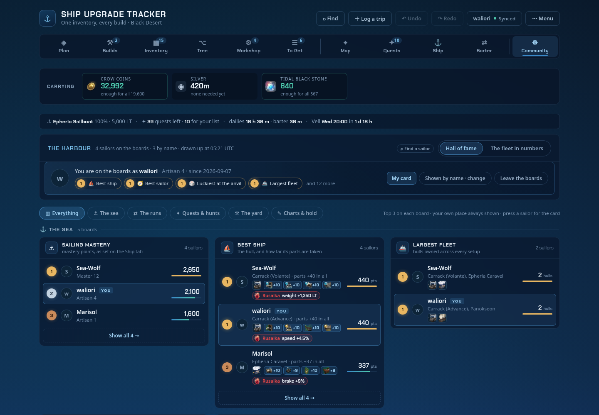

With sign-in on, the **Community** tab shows two things drawn from the
sailors on the boards:

- **The hall of fame** — sixteen boards: sailing mastery, the best ship,
  the largest fleet, the best sailor, the largest crew, the most barters,
  the most silver from runs, the most runs, the best single run, the most
  quests, the most sea monsters hunted, the most ships built, the most
  things made, the luckiest at the anvil, the cartographer, the fullest
  hold. Ties share a rank; the top ten are shown, and a signed-in sailor
  is told where they stand on every board whether or not they are in it.
- **The fleet in numbers** — everyone added up: the hulls most sailed and
  owned, the parts most fitted, the sailors most hired, the islands most
  plotted, the quests most done, the monsters most hunted, the builds
  most queued, the ships most built, the crystals most carried, and the
  spread of mastery, sailor levels, fleet sizes and runs by weekday.

A place on a board is a door. The ship boards stand the **Ship tab up on
that sailor's boat** — hull, parts, crystal, seats and roster, to look at
and not to keep, one press back to yours; the crew boards open their
best sailor in the Selected sailor panel; the rest open the sailor's
card at the section the board is about, where each quest, each monster's
grounds and each item is itself a door. The fleet in numbers has
categories, a find box and a sort, and every row that names something
the app knows opens it.

Signing in puts you on the boards by name — the Community tab says so
the first time you open it, and **Leave the boards** is one press from
there and from your card. Leaving deletes the digest the server holds
and is remembered: signing in again does not put you back. In between
the two you can be shown as an unnamed sailor instead — ranked and
counted, shown as “a sailor”; only you see which one is you. **How you
are shown** lists the digest that would be published — the numbers
above, worked out from your save by the same module the server runs —
and what is never shared: your stock, your notes, your traces, where
things are stored. The server keeps that digest and nothing else about
you for the boards, and redraws it within seconds of a save reaching it,
so a ship fitted on the Ship tab is on the boards by the time you walk
to them. Anyone who opens the page can read the boards; only an account
can be on them.

What is shared for the look is the ship as the Ship tab needs it: the
hull, what is fitted, the crystal and appearance set, who sits where,
the saved setups and the roster with its growths. Nothing else of the
save leaves.

The numbers that outlive a save — quests claimed, runs sailed, things
made, enhancement attempts — are a **tally** the profile keeps as they
happen, since the save itself holds a quest's current period and the
last sixty runs and no more. It travels with the save like the rest of
the profile, and Undo takes a count back with the thing it counted.

### If the database is lost

Nothing is lost. Every browser keeps its own copy in `localStorage`; the
database is a mirror, not the original. The next push from each player
writes their save back.

---

## Project layout

```
index.html            the whole shell: masthead, tabs, screen
server.js             static files, plus the sync API when configured
css/tracker-*.css     the design system, nine sheets linked in order
js/
  ui.js               the shell: render loop, event wiring, boot
  screen-*.js         one module per tab — plan, builds, inventory, tree,
                      workshop, to-get, map, quests, crew
  ui-state.js         the shared view state, recomputed from the store
  ui-bits.js          icons, linked names, priced costs — the screens' vocabulary
  pouch.js            the currency bar above the tabs
  peek.js             the hover card
  dialogs.js          toasts and dialogs
  fmt.js              escaping and number formats
  state.js            the store: stock, targets, undo/redo, persistence
  planner.js          pure planning — netting, explosion, costing, enhancement
  sync.js             optional device sync: pull, push, conflict
  digest.js           what a save says about its sailor, for the boards
  screen-community.js the Community tab: the hall of fame, the fleet in numbers
  feedback.js         Menu → Feedback, and the admins' inbox
  markup.js           the little markup a report is written in, and the HTML it becomes
  recipes.js          recipes and enhancement chains
  ships.js            what can be queued
  sea_coins.js        Crow Coin prices
  coin-shop.js        spending them: the dialog, and the one change it writes
  falasi_vendor.js    Falasi's silver prices
  all_barter.json     barter routes, scraped from BDOCodex
  map.js              the tile viewer's arithmetic
  barter_npcs.js      where the 91 barterers are
  searoute.js         bending a leg round the land, and timing it
  wharves.js          the 58 wharf managers and the guild wharves
  habitats.js         where each species lives, on the water
  courses.js          the community maps fitted to the chart
  today.js            the Today strip, the clocks and the Vell timetable
  clock.js            the resets, ticking in place
  pace.js             how fast each build has been moving
  triplog.js          everything one trip brought back, as one change
  guided-tour.js      the guided tour
  enhancement.js      per-level rates, Agris caps, perfect-enhance costs
  ship_stats.js       what each hull is, in the game's own numbers
  part_stats.js       what each part does, level by level
  sailors.js          the hiring pool, positions, condition, first mates,
                      and arranging a crew for a stated goal
  sailor-locales.js   the sailor window's words in every language the game runs in
  sailor-shot.js      a sailor read out of a screenshot's words -- pure, and tested
  shot-reader.js      the vendored OCR engine, the passes over a screenshot,
                      and the bank of icons a storage slot is named against
  sailor-import.js    the drop, the reading and the table that checks it
  storage-shot.js     a storage window read off its pixels: the lattice, the
                      icon each slot holds, the count over its corner, and the
                      rows two scrolled shots share -- pure
  count-net.js        the small network that reads a slot's count: convolution,
                      pooling and the CTC decoding, in plain JavaScript -- pure
  count_model.js      what it was taught: its weights, written by tools/count-reader
  storage-import.js   the Inventory's drop, and the counts it writes at a storage
  barter-shot.js      the barter window read out of a screenshot's words, against
                      the exchanges each island deals -- pure, and tested
  barter-import.js    the Barter tab's drop, and the islands it answers at once
  sea-boards.js       /api/boards from the browser: what the fleet read today
  layout-book.js      the layouts on file against what the fleet has read: which
                      layout a reading votes for, and the boards in no record -- pure
  layouts-view.js     the layout book's dialog: cards, a board opened out, search
  quests.js           the quests that pay in ship materials
  sea_crystals.js     the 287 sea crystal variants, by grade
  gamefile.js         writing stops into the game's own world map
  market.js           Central Market prices, per region, kept offline
reader/               Tesseract, vendored: every screenshot is read in the browser
tools/check-env.mjs   npm run check -- validates a sync configuration
server/               only loaded when sync is configured
  config.js           what is switched on, and what is therefore offered
  db.js               libSQL schema and queries
  auth.js             the Discord OAuth exchange
  api.js              /api/me and /api/state
  community.js        /api/community — the boards, built from the digests
  boards.js           /api/boards — what the fleet saw of today's barter board
  feedback.js         /api/feedback — posts, screenshots, the inbox, a copy to a webhook
  images.js           is this actually a picture, and how big is it
  market.js           /api/market — the Market relay, on by default
  session.js          signed session cookies, no session table
test/                 npm test — the server, the cost model, and a browser
icons/                item and ship icons (WebP)
icon_mapping.json     item -> icon file and BDOCodex page
og.png                the social preview card
docs/media/           the images and clips in this README
docs/media/small/     the narrow copies the app itself serves
docs/media/guide/     the seven narrated chapters, with their captions
CHANGELOG.md          generated from js/about.js by tools/build-changelog.mjs
tools/capture/        the harness that generates the media, film included
```

The planner is pure: given stock, a queue and your craft-or-buy choices,
it returns a requirement tree per build, netted against one draining pool
of stock, and a cost for any route through it. The UI is a projection of
that — no screen keeps its own copy of anything.

---

## Contributing

Useful things to send:

- **Data corrections.** Prices move, recipes change with patches. A
  screenshot of the in-game source is the fastest way to get one merged.
- **New ships and parts** as Pearl Abyss releases them.
- **Bugs** — what you did, what you expected, what happened, and your
  browser.

The README's images and clips are generated, not hand-recorded; see
[`tools/capture/README.md`](tools/capture/README.md) before changing the
UI so they can be re-shot.

---

## License

**MIT with Attribution** — see [LICENSE](LICENSE).

The MIT licence with one condition added. Use it, change it, sell it, fork it,
host it; no fee, no permission needed. The one thing asked in return is that
credit travels with it: if you put this code in front of other people — as a
site, an app, or a release — say that the original is by **waliori** and link
to <https://github.com/waliori/bdo-ship-upgrade-tracker>, somewhere a person
using your version can actually find it. An About page, a footer or your README
all do the job.

## Thanks

Pearl Abyss for the game, [BDOCodex](https://bdocodex.com/) for item
data, and everyone who has reported a wrong number.

**Fair winds, adventurer.** 🌊
