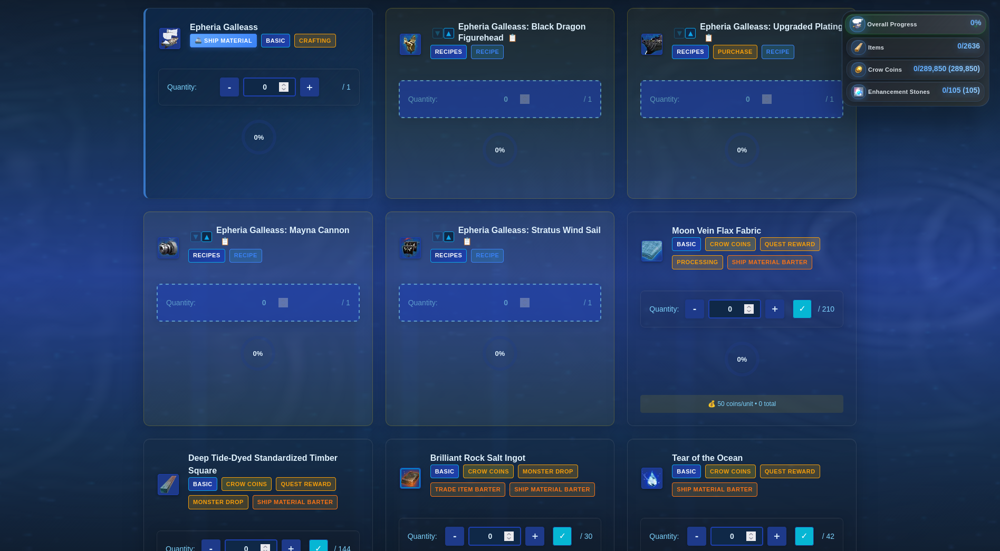

# 🚢 BDO Ship Upgrade Tracker

A comprehensive web application for tracking Black Desert Online ship upgrade materials and progress. Plan your maritime journey with precision and style!


## ✨ Features

### 🏗️ Ship Management
- **Multiple Ship Support**: Track upgrades for 11 different ships from Epheria Sailboat to Panokseon
- **Visual Ship Selection**: Dropdown with ship icons, stats, and completion percentages
- **Progress Tracking**: Real-time progress calculation with visual indicators
- **Smart Ship Search**: Quickly find specific ships in the dropdown


### 📦 Material Tracking System
- **Comprehensive Material Database**: Track hundreds of upgrade materials
- **Smart Categorization**: Organized into Basic Supplies, Crafting Orders, and more
- **Visual Progress Indicators**: Circular progress bars and completion percentages
- **BDO Codex Integration**: Click any item name to view detailed information



### 🔨 Recipe Management
- **Interactive Recipe Modals**: Detailed crafting management for complex items
- **Hybrid Progress Calculation**: Tracks both completed items and raw materials
- **Smart Material Requirements**: Automatically adjusts based on completed items
- **Batch Operations**: Quick completion and reset buttons


### 🎯 Advanced Tracking Features
- **Enhancement Level Support**: Adjust enhancement levels with ▲▼ arrows
- **Acquisition Methods**: Visual badges showing Vendor, Recipe, Barter sources
- **Search & Filtering**: Find materials quickly with search and filter chips
  


- **Floating Progress Panel**: Always-visible progress tracking that follows you


### 📊 Progress Dashboard
- **Real-time Statistics**: Overall progress, completed items, and resource counts
- **Crow Coins Tracking**: Monitor special currency requirements
- **Enhancement Stones**: Track upgrade materials needed
- **Visual Progress Bars**: Beautiful animated progress indicators


## 🚀 Quick Start

### Prerequisites
- Node.js 16+ installed
- Modern web browser (Chrome, Firefox, Safari, Edge)

### Installation

1. **Clone the repository**
   ```bash
   git clone https://github.com/waliori/bdo-ship-upgrade-tracker.git
   cd bdo-ship-upgrade-tracker
   ```

2. **Install dependencies**
   ```bash
   npm install
   ```

3. **Start the development server**
   ```bash
   npm start
   ```

4. **Open your browser**
   Navigate to `http://localhost:8000`

## 🎮 How to Use

### Getting Started
1. **Select Your Ship**: Use the dropdown to choose which ship you're upgrading
2. **Explore Materials**: Browse through the material cards to see what's needed
3. **Track Progress**: Click on material cards to open quantity controls
4. **Manage Recipes**: Click recipe cards (with 📋 icon) to open crafting management

### Key Interactions
- **Material Cards**: Click to open quantity tracking controls
- **Item Names**: Click to view detailed info on BDOCodex
- **Enhancement Arrows (▲▼)**: Adjust enhancement levels for ship parts
- **Search Box**: Find specific materials quickly
- **Filter Chips**: Show only certain types of materials (Vendor, Recipe, etc.)

### Recipe Management
1. Click any recipe card (marked with 📋)
2. Track completed items in the top section
3. Monitor raw materials in the bottom section
4. Use quantity controls (-/+/✓) to update progress
5. Click "Complete Recipe" when finished


## 🔧 Technical Details

### Built With
- **Frontend**: Vanilla JavaScript (ES6+), HTML5, CSS3
- **Backend**: Node.js with Express
- **UI Framework**: Custom ocean-themed CSS with CSS Grid/Flexbox
- **Animations**: Motion library for smooth interactions
- **Tours**: Driver.js for guided user experience

### Architecture
```
bdo-ship-upgrade-tracker/
├── index.html              # Main application page
├── server.js              # Express server for local hosting
├── package.json           # Dependencies and scripts
├── css/
│   └── modern-layout.css  # Ocean-themed UI framework
├── js/
│   ├── app.js            # Main application logic
│   ├── ships.js          # Ship data and configurations
│   ├── recipes.js        # Recipe and crafting data
│   ├── guided-tour.js    # Interactive tutorial system
│   └── [other modules]   # Specialized functionality
└── icons/                # Ship and item icons (WebP)
```

### Key Features Implementation
- **Modular Design**: Separated concerns with ES6 modules
- **Local Storage**: Persistent progress tracking
- **Performance Optimized**: Lazy loading and efficient rendering
- **Mobile Responsive**: Adaptive layout for all screen sizes

## 🎯 Supported Ships

| Ship Type | Support |
|-----------|-------------------|
| Epheria Sailboat | ✅ |
| Improved Epheria Sailboat | ✅ |
| Epheria Caravel | ✅ |
| Carrack (Advance/Balance) | ✅ |
| Epheria Frigate | ✅ |
| Improved Epheria Frigate | ✅ |
| Epheria Galleass | ✅ |
| Carrack (Volante/Valor) | ✅ |
| Panokseon | ✅ |

## 🌟 Why Use This Tracker?

- **Save Time**: No more manual spreadsheets or note-taking
- **Reduce Mistakes**: Accurate material calculations and tracking
- **Plan Efficiently**: See exactly what you need before starting
- **Track Multiple Projects**: Switch between different ship upgrades easily


## 🤝 Contributing

We welcome contributions! Here's how you can help:

### Ship Data Updates
- Add new ships when released by Pearl Abyss
- Update material requirements for game patches
- Improve ship statistics and information

### Feature Enhancements
- Add new tracking capabilities
- Improve UI/UX design
- Optimize performance
- Add internationalization

### Bug Reports
1. Check existing issues first
2. Provide detailed reproduction steps
3. Include browser and version information
4. Add screenshots if applicable

## 📝 License

This project is licensed under the MIT License - see the [LICENSE](LICENSE) file for details.

## 🙏 Acknowledgments

- **Pearl Abyss**: For creating Black Desert Online
- **BDO Community**: For feedback and testing
- **BDOCodex**: For item data
- **Contributors**: Everyone who helped/will help improve this tracker

## 🔗 Links

- **BDO Codex**: [Official Item Database](https://bdocodex.com/)
- **Black Desert Online**: [Official Website](https://www.blackdesertonline.com/)
- **Report Issues**: [GitHub Issues](https://github.com/waliori/bdo-ship-upgrade-tracker/issues)

---

**Happy Sailing, Adventurer!** ⚓🌊

<!-- PLACEHOLDER: Footer image with ships sailing -->
